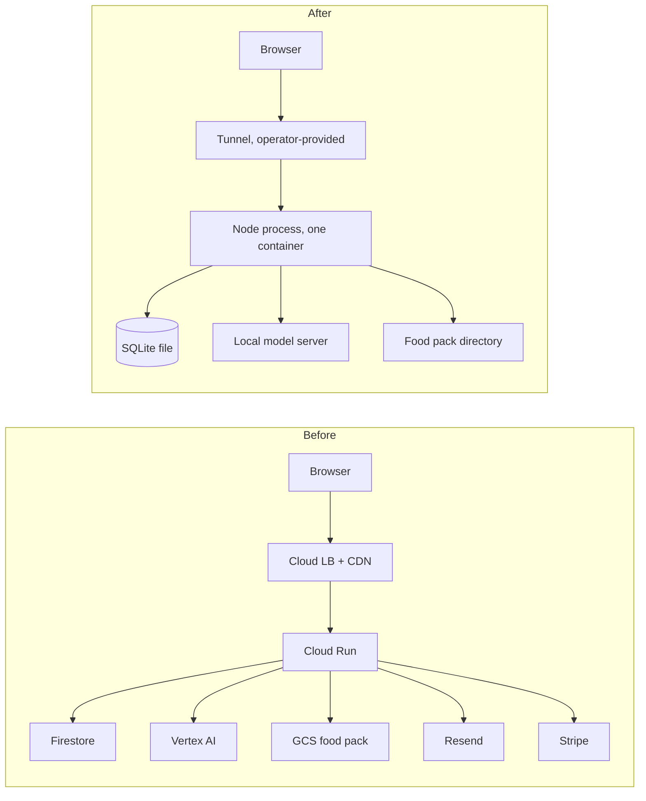
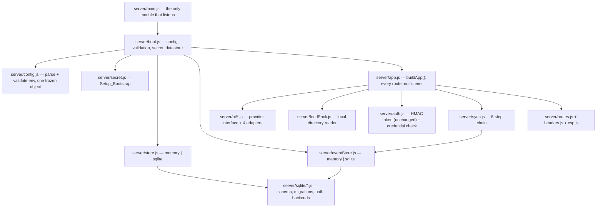
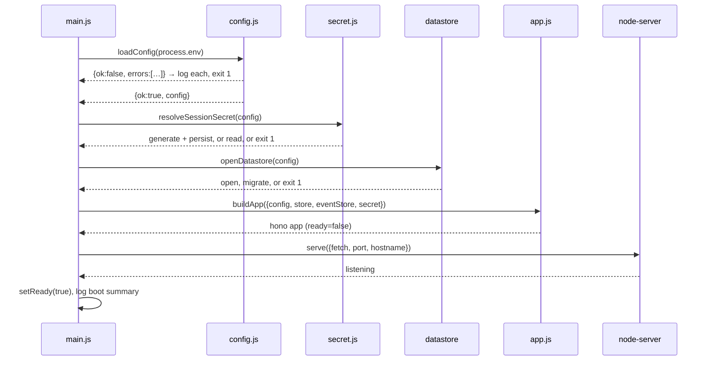

# Design Document

## Overview

The conversion is mostly subtraction. The codebase already has the seams a self-hosted build needs, because they were cut for local development: two datastores behind a backend switch with a complete in-memory implementation, a `MOCK_AI` path that stands in for Vertex, a route table that every layer derives from rather than duplicating, and a client that treats IndexedDB as the source of truth and the server as an optional replica. What has to be *added* is small — a SQLite backend, an AI adapter layer, a local file reader for the food pack, a credential check, and a boot sequence that validates before it listens.

Three places are genuinely hard, and they are where most of this document goes:

1. **The boot sequence.** Six requirements demand "log and exit non-zero *before* listening", and `server/index.js` currently calls `serve()` at import time and throws from module scope. That is not a place a guard can live. The module has to be split.

2. **The SQLite event store.** `server/eventStore.js` is not a CRUD table. It carries a per-account monotonic sequence, a purge epoch that invalidates cursors, a per-id clock clamp with a re-send recognition rule, a tombstone sweep, and a merge ordering that is total over arbitrary JSON. All of it has to be reproduced exactly, because Requirement 3 makes equivalence with the memory backend an executable property.

3. **Origin independence.** The build bakes `https://snapgut.com` into canonical tags, OG tags, JSON-LD, the sitemap, and robots.txt, and the server compares the request `Host` against it to decide `noindex`. Worse, the JSON-LD body is SHA-256 hashed at build time and that hash goes into the `script-src` directive — so rewriting the block at request time silently breaks it in the browser with no server-side error. The design removes the absolute URLs rather than rewriting them, which dissolves the hash coupling entirely.

Everything else follows from those, plus a long tail of deletion.

### What is being removed

| Surface | Files | Why |
| --- | --- | --- |
| Stripe billing | `server/index.js:39,59-77,205-212,620-888`, `shared/plans.{js,d.ts}`, `scripts/stripe-*`, `src/Paywall.tsx` | Requirement 1 |
| Entitlement gating | 402 gates at `server/index.js:324-326,448-450`, `server/sync.js:761-775`, and 9 client modules | Requirement 1 |
| Firestore | `firestoreStore()` in `server/store.js`, `createFirestoreEventStore()` in `server/eventStore.js` | Decision D1 |
| Vertex AI | `getModel()` at `server/index.js:216-233` | Requirement 4 |
| GCS food pack | `server/index.js:900-940` | Requirement 5 |
| Resend + emailed codes | `server/email.js`, `/api/auth/request`, `/api/auth/verify` | Requirement 6 |
| Telemetry | `server/index.js:127-193`, `/api/metrics`, `/api/admin/*`, `src/metrics.ts` | Requirement 11 |
| Google Sheets sync | `src/googleSheets.ts` (1,343 lines) and the `"sheets"` destination | Requirement 11 |
| Absolute origin | `CANONICAL_ORIGIN`, JSON-LD, sitemap, `isCanonicalHost` | Requirement 8 |
| GCP infrastructure | `infra/` (9 Pulumi modules + stack config) | Requirement 9 |

Net effect on dependencies: `@google-cloud/firestore`, `@google-cloud/storage`, `@google-cloud/vertexai`, `resend`, and `stripe` all leave. Nothing is added — SQLite comes from the Node runtime and every AI provider is reached over `fetch`. The production dependency list drops from 12 packages to 6, all of which are `hono`, `@hono/node-server`, and client-side React.

## Architecture

### Current shape versus target shape



Everything to the right of the container in the "after" picture is either a file on a mounted volume or a process the operator already runs. The tunnel is outside the box on purpose: Requirement 8.3 forbids bundling one.

### Module layout after the conversion



The one structural rule: **`server/main.js` is the only module that calls `serve()`**. Everything else is importable by a test without binding a port. This is the generalisation of a pattern the codebase already discovered twice — `server/sync.js` and `server/routes.js` both exist as separate modules specifically because `index.js` calls `serve()` at import time, and both carry a comment saying so. The conversion finishes the job rather than adding a third instance of the workaround.

## Components and Interfaces

Every signature below is either new or a change to an existing one. Modules not listed keep their current interface.

### `server/config.js` — new

```js
/**
 * Resolve and validate every setting. Pure: reads no file, logs nothing, never throws.
 * @param {Record<string, string|undefined>} env
 * @returns {{ ok: boolean, config: Config|null, errors: string[], warnings: string[] }}
 */
export function loadConfig(env);
```

`Config` is a frozen object and is the only thing downstream modules read for configuration — `process.env` is not consulted below this line. Its shape is in [Data Models](#data-models).

### `server/secret.js` — new

```js
/**
 * The Session_Secret, from config or the persisted file, generating and writing
 * one when neither exists (Req 7.1).
 * @returns {{ secret: string, source: "env"|"file"|"generated", path: string|null }}
 * @throws {ConfigError} when a supplied or persisted secret is under 32 bytes (Req 7.14)
 */
export function resolveSessionSecret(config);
```

### `server/app.js` — new, extracted from `index.js`

```js
/**
 * Every route, no listener. The whole server as a testable value.
 * @param {{ config: Config, store, eventStore, secret: string, ai: AiProvider,
 *           ready: { value: boolean } }} deps
 * @returns {Hono}
 */
export function buildApp(deps);
```

`ready` is a mutable cell rather than a boolean so `main.js` can flip it after `serve()` resolves and a test can hold it at `false` (Req 9.7).

### `server/main.js` — new, the only module that listens

No exports. Runs the five boot phases and calls `serve()`.

### `server/store.js` — surface reduced

```js
export function getStore(config);        // was: no argument, read process.env
```

The method surface after Requirements 6.9 and 11.8:

| Method | Change |
| --- | --- |
| `getUser(email)` | unchanged |
| `upsertUser(email, now?)` | `now` added for Req 3.10 exactness |
| `deleteUser(email)` | unchanged |
| `rateLimit(key, max, windowMs, now?)` | `now` added |
| `recordMissingFood(slug, reason, now?)` | `now` added |
| `listMissingFoods(limit)` | unchanged |
| `getCode` / `setCode` / `clearCode` | **removed** (Req 6.9) |
| `incMetric` / `listMetrics` / `touchUser` / `userStats` | **removed** (Req 11.8) |
| `getUserByStripeCustomerId` / `setPro` / `setComp` / `incFreeAi` | **removed** (Req 1.8) |
| `isPro` / `entitlement` / `FREE_AI_LIMIT` | **removed** (Req 1.8) |

### `server/eventStore.js` — one new backend, one removed

```js
export function createSqliteEventStore(db);   // new; mirrors createFirestoreEventStore(db)
export function createFirestoreEventStore(db); // removed (D1)
```

The five store methods keep their exact signatures, `now` default parameters included. Every shared helper — `planPush`, `mergeRecords`, `compareForMerge`, `canonicalKey`, `normalizeForStore`, `clampUpdatedAt`, `formatCursor`, `parseCursor`, `pageLimit`, `storableId` — is unchanged. `assertPathSegment` is removed with the Firestore backend.

### `server/ai/index.js` — new

```js
/** @typedef {{ prompt: string, image?: { data: string, mimeType: string },
 *              json: boolean, signal: AbortSignal }} AiRequest */
/** @typedef {{ name: string, model: string,
 *              generate: (req: AiRequest) => Promise<string> }} AiProvider */

/** @returns {AiProvider} @throws {ConfigError} on an unknown provider or missing setting */
export function createAiProvider(config);
```

Adapters in `server/ai/{ollama,openai,gemini,mock}.js`, each exporting a factory of the same shape. `generate` returns raw model text and neither parses nor sanitises it — the defended parse stays at the call site (Req 4.9, 4.16).

### `server/foodPack.js` — new, replaces the GCS proxy

```js
/** @returns {{ ok: true, bytes: Buffer } | { ok: false, reason: "invalid"|"missing"|"unreadable" }} */
export async function readPackFile(dir, name);

/** Boot-time survey for the summary log and the symlink warning (Req 9.8, 5.4). */
export async function surveyPack(dir);
```

### `server/auth.js` — secret injected, credential check added

```js
export function signToken(email, secret);            // was: module-scope SECRET
export function verifyToken(token, secret);          // was: module-scope SECRET
export function credentialMatches(submitted, expected, secret);  // new (Req 6.3)
export function generateCode / hashCode / safeEqualHex;          // removed (Req 6.8)
```

### `server/headers.js` and `server/csp.js` — origin coupling removed

```js
export function shouldNoIndex(cls, publicOrigin);   // was: (cls, host)
export function isCanonicalHost(host);              // removed
export const CSP;                                   // now the only policy
export function cspForMarketingPath / withScriptHashes / loadCspHashes
  / cspHashes / reloadCspHashes;                     // all removed
```

### Client — `src/session.ts`

```ts
export interface Me { email: string }                // was: extends Entitlement
export function signIn(password: string): Promise<Me>;  // new
export function requestCode / verifyCode / fetchPlans / checkout / openPortal;  // removed
export interface Entitlement / Plan;                 // removed
```

## Data Models

### SQLite schema, version 1

```sql
PRAGMA journal_mode = WAL;      -- concurrent readers, and a crash-safe log
PRAGMA foreign_keys = ON;
PRAGMA busy_timeout = 5000;

CREATE TABLE schema_meta (
  key   TEXT PRIMARY KEY,
  value TEXT NOT NULL
);                              -- ('version', '1')

-- The account. After Requirement 1.8 strips entitlement and Requirement 11.8
-- strips the retention field, two columns remain.
CREATE TABLE users (
  email      TEXT PRIMARY KEY,
  created_at INTEGER NOT NULL
);

-- Fixed-window counters. The bucket is floor(now / windowMs), exactly as
-- `rateLimitWindow` in store.js computes it today.
CREATE TABLE rate_limits (
  key        TEXT    NOT NULL,
  bucket     INTEGER NOT NULL,
  count      INTEGER NOT NULL,
  expires_at INTEGER NOT NULL,
  PRIMARY KEY (key, bucket)
) WITHOUT ROWID;
CREATE INDEX rate_limits_expires ON rate_limits (expires_at);

-- Coverage tally (Decision D4: the write path survives, the read route does not).
CREATE TABLE missing_foods (
  slug      TEXT PRIMARY KEY,
  reason    TEXT    NOT NULL,
  count     INTEGER NOT NULL,
  last_seen INTEGER NOT NULL
) WITHOUT ROWID;

-- Per-account sync bookkeeping: the same three fields `getMeta` returns.
CREATE TABLE sync_meta (
  email                   TEXT PRIMARY KEY REFERENCES users(email) ON DELETE CASCADE,
  seq                     INTEGER NOT NULL DEFAULT 0,
  epoch                   INTEGER NOT NULL DEFAULT 1,
  last_tombstone_sweep_at INTEGER
);

CREATE TABLE events (
  email        TEXT    NOT NULL,
  id           TEXT    NOT NULL,
  seq          INTEGER NOT NULL,
  clamped_from INTEGER,
  deleted      INTEGER NOT NULL DEFAULT 0,
  updated_at   INTEGER,          -- NULL when the record's updatedAt is not an integer
  record       TEXT    NOT NULL, -- the whole wire record, JSON
  PRIMARY KEY (email, id)
) WITHOUT ROWID;
CREATE INDEX events_seq   ON events (email, seq);
CREATE INDEX events_sweep ON events (email, deleted, updated_at);
```

### The stored Event_Record

Unchanged from what `normalizeForStore` already produces, and reproduced here because the SQLite column layout only makes sense against it.

| Property | Value |
| --- | --- |
| Stripped before storage | `undefined` values, `photo`, `seq`, `clampedFrom`, `deleted: false`, and every content field of a tombstone (`note`, `dish`, `ingredients`, `symptoms`, `bristol`, `stress`, `sleep`) |
| Stripped before `pull` returns | `seq`, `clampedFrom` |
| Preserved verbatim | every unrecognised top-level field from a newer `schemaVersion` |
| Clamped | `updatedAt` above `now + 86_400_000` becomes `now`; the pre-clamp value is kept in `clamped_from` |
| Tombstone marker | `deleted === true`, the only one |

`record` holds the whole thing as JSON. `deleted` and `updated_at` are denormalised copies that exist solely to index the tombstone sweep and are never read as truth.

### Cursor

`"{epoch}:{seq}"`, decimal, matched by `/^(\d+):(\d+)$/`. Both components clamped to `0 … Number.MAX_SAFE_INTEGER`. Codec shared by both backends and mirrored in `src/cloudSync.ts` — it is not per-backend and does not change.

A cursor is invalid when it fails the pattern, exceeds the safe-integer range, or carries an `epoch` other than the account's current one. `deleteAll` increments `epoch` and resets `seq` to 0, which is what turns every previously issued cursor into an explicit reset signal rather than a silently empty page.

### `Config`

```js
/**
 * @typedef {object} Config
 * @property {number} port
 * @property {string} bindHost
 * @property {boolean} exposedBind          derived: bindHost is not loopback
 * @property {string|null} publicOrigin
 * @property {boolean} requireHttps
 * @property {"none"|"xff"|"cloudflare"} trustedProxy
 * @property {string} dataDir
 * @property {string} dbPath
 * @property {"sqlite"|"memory"} datastoreBackend
 * @property {string} foodPackDir
 * @property {{ provider: "ollama"|"openai"|"gemini"|"mock", baseUrl: string|null,
 *              model: string, apiKey: string|null, timeoutMs: number }} ai
 * @property {{ email: string, password: string|null }} auth
 * @property {string|null} sessionSecret
 */
```

Frozen, and the only configuration surface below `main.js`. `exposedBind` is derived once here rather than recomputed at each of the three places that need it (Req 2.8, 7.4, 7.6).

### Constants that do not change

`MAX_PULL_LIMIT` 500 · `MAX_CLOCK_SKEW_MS` 86,400,000 · `TOMBSTONE_RETENTION_MS` 15,552,000,000 (180 days) · `INITIAL_SEQ` 0 · `INITIAL_EPOCH` 1 · `MAX_ID_BYTES` 1,500 · `MAX_CANONICAL_DEPTH` 16 · `MAX_SYNC_BODY_BYTES` 1,048,576 · `MAX_RECORDS_PER_PUSH` 200 · `MAX_RECORD_BYTES` 16,384 · `MAX_STORED_RECORDS` 100,000 · `MAX_BODY` 8 MiB.

`MAX_RECORDS_PER_PUSH` is worth a note: 200 was chosen because Firestore's transaction limit is 500 writes and a push writes 200 records plus one counter. SQLite has no such limit, so the constraint is now arbitrary — but it is a client-visible contract (`src/cloudSync.ts` packs to it and the server answers `record_limit` above it), so it stays. Requirement 12.6 pins it.

## Boot sequence

### The problem

`server/index.js` today:

```js
const PORT = Number(process.env.PORT) || 8080;        // line 30
if (IS_PROD && !process.env.SESSION_SECRET) throw …    // line 45, module scope
if (IS_PROD && process.env.USERS_BACKEND !== …) throw … // line 52, module scope
const app = new Hono();                                // line 79
// … 950 lines of route registration …
serve({ fetch: app.fetch, port: PORT }, …);            // line 1048
```

A module-scope `throw` during ESM evaluation produces an unhandled rejection and a stack trace, not a logged message and a chosen exit code. And several of the new guards are *asynchronous* — opening the SQLite file, reading the persisted secret, stat-ing the mounted volume — which module scope cannot express at all without top-level await ordering games.

### The design

Five ordered phases, each of which may fail the process before the next begins:



Phase 1 — **config** (`server/config.js`). One pure function `loadConfig(env)` returning `{ ok, config, errors, warnings }`. It never throws, never reads a file, never logs. Every setting is resolved and validated here, so the rest of the server reads a frozen object rather than `process.env`, and a test constructs a config literal instead of stubbing the environment. Validation covers Requirements 2.11 (unknown `DATASTORE_BACKEND`), 4.14 (unknown `AI_PROVIDER`, missing base URL or key), 7.4 (exposed bind without a credential), 7.14 (short `SESSION_SECRET`), and 8.1 (`PORT` outside 1–65535).

Phase 2 — **secret** (`server/secret.js`). If `config.sessionSecret` is set, use it. Otherwise read `${DATA_DIR}/session-secret`; if absent, generate 32 bytes from `randomBytes`, write with mode `0o600`, and log the path. Requirement 7.1's "report where it was written" is the path, never the value.

Phase 3 — **datastore**. `openDatastore(config)` returns `{ store, eventStore, close }`. For SQLite this opens the file, creates parent directories, runs migrations, and verifies the mount is writable (Requirement 9.12) by the act of opening in read-write mode. A failure logs the path and the underlying error and exits 1 (Requirements 2.6, 9.12).

Phase 4 — **app**. `buildApp(deps)` registers every route and returns the Hono instance. Pure with respect to the environment: everything it needs arrives in `deps`. This is what makes the whole server testable in-process — the existing tests that `vi.mock("@hono/node-server")` to capture the fetch handler can call `buildApp` directly instead.

Phase 5 — **listen**, then flip readiness, then log the summary Requirement 9.8 asks for:

```
snapgut listening on http://127.0.0.1:8080
  datastore  sqlite (/data/snapgut.db, schema v1)
  ai         ollama (http://127.0.0.1:11434, llama3.2-vision)
  food pack  3036 files (/data/food-pack)
  session    secret loaded from /data/session-secret
  auth       AUTH_PASSWORD (set)
```

### Why the ready flag is separate from listening

Requirement 9.7 wants a health route that reports not-ready until the datastore is open. Since phase 3 precedes phase 5, the datastore is *always* open before the socket exists, which would make the not-ready state unreachable — and an unreachable state is an untestable one. So `GET /api/health` reads a mutable `ready` cell that `buildApp` receives, `main.js` sets after `serve()` resolves, and a test can hold at `false` to assert the not-ready response. It also gives a place to report a future degraded state without changing the contract.

The route is unauthenticated (Requirement 9.7) and returns only `{ ready, schema }` — no version, no config, no counts. A health endpoint on a box the operator may have exposed to the internet is not a place to describe the deployment.

## Datastore

### Decision D1 — Firestore is deleted

Both backend switches collapse from three cases to two:

```js
// server/store.js and server/eventStore.js, before
const BACKEND = process.env.USERS_BACKEND === "firestore" ? "firestore" : "memory";
```

becomes a `config.datastoreBackend` of `"sqlite" | "memory"`, defaulting to `"sqlite"` (Requirement 2.10), with an unknown value a boot failure (Requirement 2.11). The memory backend survives untouched for the test suite (Requirement 2.7).

Deleting Firestore removes the one documented behavioural divergence between backends. `server/eventStore.js:600-618` carries a `KNOWN DIVERGENCE` note: the Firestore backend never sweeps expired tombstones, because the sweep needs a second filter on the events collection that would force a composite index, so `lastTombstoneSweepAt` stays `null` there forever. SQLite has no such constraint — the sweep is one indexed `DELETE` — so the new backend matches memory exactly, including that field. Requirement 3.2's demand that `getMeta` agree across backends is achievable *because* Firestore is going; it would have been false on the existing pair.

### Decision D7 — `node:sqlite`, and Node 24 as the floor

| | `node:sqlite` | `better-sqlite3` |
| --- | --- | --- |
| Native build | none | node-gyp, with prebuilds for common platforms |
| Image size | unchanged | +toolchain on a prebuild miss |
| ARM + x86-64 | free (Requirement 9.1) | needs a prebuild per architecture or a compiler in the image |
| Node floor | 24 | 20 |
| API | synchronous `DatabaseSync` | synchronous |

Chosen: **`node:sqlite`**, raising the minimum Node version to 24. The deciding factor is Requirement 9.1's ARM-and-x86-64 support combined with Requirement 10.3 pinning the README to the manifest: a native module means either shipping a compiler in the runtime image or debugging prebuild resolution on whatever architecture a self-hoster happens to own, and "it failed to install" is the worst possible first impression for a project whose pitch is that it is easy to run. A raised Node floor costs nothing to a `docker compose up` user, because the version is the image's.

The cost worth naming: the API is synchronous, so every query blocks the event loop. For a single-user diary this is not merely acceptable, it is a simplification — transaction atomicity needs no locking discipline, because no other request can interleave between `BEGIN` and `COMMIT`. It would be the wrong choice for a multi-tenant deployment, which is exactly what this conversion is not.

Both store modules keep their `async` method signatures despite the synchronous driver. Requirement 2.2 demands the same call signature and return shape as the memory backend, and every caller already awaits.

### Schema

The tables are in [Data Models](#data-models). Four things about `events` are deliberate.

**`record` is the whole wire record as one JSON column, not a set of typed columns.** `normalizeForStore` preserves unrecognised top-level fields verbatim — a record from a newer `schemaVersion` travels through the server untouched, and Requirement 3.9 makes that a property with a byte-level obligation on the key-sorted JSON form. A fixed column set cannot hold an open field set, and an overflow column plus known columns means two places to keep in sync and a merge rule that reads from both. One JSON blob is the honest representation of what the server actually stores: an opaque document keyed by `(account, id)`.

**`deleted` and `updated_at` are denormalised copies of fields inside that JSON.** They exist only to index the tombstone sweep, which is `DELETE FROM events WHERE email = ? AND deleted = 1 AND updated_at IS NOT NULL AND updated_at < ?`. Without them the sweep is a full scan and a JSON parse per row. They are written from the normalised record on every write and never read as truth — every merge, every pull, every comparison reads the JSON.

**The primary key is `(email, id)`, which is the same composite key Firestore expressed as a path.** `storableId` stays as the guard, even though SQLite has no path semantics to violate: it is the client-facing contract (`server/sync.js` rejects `invalid_record` on a failure), and relaxing it would let a record be stored that could not be represented on the old backend. `assertPathSegment`, which was Firestore-specific, goes.

**`WITHOUT ROWID` on the tables whose primary key is the natural key.** Saves the extra B-tree and the indirection on the read path, which is every pull.

### Mapping the event store's semantics onto SQL

| Concept | Memory backend | SQLite backend |
| --- | --- | --- |
| Sequence allocation | read `state.seq`, assign `+1…+N`, write back | `SELECT seq FROM sync_meta` … `UPDATE sync_meta SET seq = ?`, inside the transaction |
| Atomicity of a push | no `await` between read and write-back | `BEGIN IMMEDIATE` … `COMMIT`, synchronous driver |
| Purge epoch | `state.epoch += 1` after clearing | `DELETE FROM events WHERE email = ?` then `UPDATE sync_meta SET seq = 0, epoch = epoch + 1` |
| Cursor | `"{epoch}:{seq}"`, unchanged | unchanged — the codec is shared, not per-backend |
| Cursor invalidation | `parsed.epoch !== state.epoch` | identical comparison against the loaded row |
| Clock clamp | `clampedFrom` on the map entry | `clamped_from` column |
| Re-send recognition | `republishedClamp(entry, incoming, candidate)` | identical — `planPush` is shared |
| Tombstone sweep | walk every record on pull and countFor | indexed `DELETE`, same trigger points |
| Page + `hasMore` | filter, sort, slice, compare lengths | `WHERE seq > ? ORDER BY seq LIMIT ?+1`, same one-extra-row trick Firestore used |

The important structural point: **`planPush`, `mergeRecords`, `compareForMerge`, `canonicalKey`, `normalizeForStore`, `clampUpdatedAt`, `formatCursor`, `parseCursor`, `pageLimit`, and `sweepExpiredTombstones`'s predicate are already backend-independent** and live at module scope in `server/eventStore.js`. The Firestore and memory backends differ only in their commit path — the file says so at line 592, and it is true. The SQLite backend is a third commit path over the same planner. That is why this is tractable at all, and why the equivalence property in Requirement 3 has a chance of holding rather than being aspirational.

`push` in outline:

```js
async push(email, records, now = Date.now()) {
  const list = Array.isArray(records) ? records : [];
  for (const r of list) if (!storableId(r?.id)) throw new Error("event store: unusable event id");
  if (list.length === 0) return { outcomes: [], stored: 0, highestSequence: null };

  db.exec("BEGIN IMMEDIATE");
  try {
    ensureUser(email);
    const meta = readMeta(email);
    const ids = distinctIds(list);
    const entries = loadEntries(email, ids);            // one SELECT … WHERE id IN (…)
    const { outcomes, writes } = planPush(list, (id) => entries.get(id) ?? null, now);

    let seq = meta.seq;
    for (const [id, written] of writes) upsertEvent(email, id, written, ++seq);
    if (writes.size > 0) setSeq(email, seq);

    db.exec("COMMIT");
    return { outcomes, stored: writes.size, highestSequence: writes.size > 0 ? seq : null };
  } catch (err) {
    db.exec("ROLLBACK");
    throw err;
  }
}
```

`BEGIN IMMEDIATE` rather than a deferred transaction: the first statement is a read, and a deferred transaction would take a shared lock and could fail to upgrade on write. Requirement 2.2's all-or-nothing obligation is satisfied by the transaction, and Requirement 2.2's "surface a failed write as an error" by the rethrow after rollback — which `server/sync.js`'s error boundary already answers as a 500 with the error's class name only.

### Rate-limit expiry

Firestore expired counter rows through a TTL policy. SQLite has none, so Requirement 2.12 makes the sweep explicit: every `rateLimit` call first deletes rows whose window ended at least two window durations ago. Two, not one, for the reason `rateLimitWindow`'s comment already gives — expiring a counter early silently *raises* the limit, expiring it late costs one small row.

Piggybacking the sweep on the call that already writes avoids a timer, and a timer in a process that may be a container with no scheduler is a liability. The cost is one extra `DELETE` per rate-limited request, against an indexed integer column, on a database with a handful of rows.

### Migrations

`schema_meta.version`, an ordered array of migration functions, each run inside a transaction, applied at boot before the server listens. Version 1 is the schema above. Requirement 10.11 wants the README to say whether upgrades apply automatically: they do, and the README's upgrade section says so and tells the operator to copy the database file first.

A forward-only design with no down migrations. A self-hoster's recovery path for a bad upgrade is the file copy the upgrade instructions insisted on, which is more reliable than a reverse migration nobody has ever run.

## Datastore equivalence harness

Requirement 3 is the specification's spine: it is what makes "the SQLite backend behaves like the memory backend the tests already trust" checkable rather than hoped for. It lands as `src/datastore.equivalence.test.ts` and `src/eventStore.equivalence.test.ts`.

### The clock is already injectable

Worth stating because it changes the cost of this section from "refactor the store" to "write the test". Every clock read in `server/eventStore.js` is a default parameter — `normalizeForStore(record, now = Date.now())`, `push(email, records, now = Date.now())`, `pull(email, cursor, limit, now = Date.now())`, `countFor(email, now = Date.now())` — and `clampUpdatedAt`, `wasClamped`, `planPush`, and `sweepExpiredTombstones` all take `now` as a *required* argument. There is no bare `Date.now()` in any function body and none at module scope. `deleteAll` and `getMeta` never read the clock at all.

So the harness drives both backends deterministically with no production change. Two small gaps remain:

- `server/sync.js` calls `countFor`, `push`, and `pull` without a `now` (lines 842, 864, 896). End-to-end sync tests that need a controlled clock require `now` threaded through those three call sites. Cheap, and worth doing while the entitlement gate is being removed from the same file.
- `store.js`'s `upsertUser` (`createdAt`) and `recordMissingFood` (`lastSeen`) read the clock with no parameter. Adding an optional `now` to both makes the comparison exact; Requirement 3.10's 5,000 ms tolerance exists as the fallback if that change is deferred. **Recommendation: add the parameter.** A tolerance in an equality relation is a place where a real divergence can hide.

### Structure

```js
const backends = () => ({
  model: createMemoryEventStore(),
  real: createSqliteEventStore(openTempDb()),
});

await fc.assert(fc.asyncProperty(callSequence(), async (calls) => {
  const { model, real } = backends();
  let now = BASE_NOW;
  for (const call of calls) {
    now += call.advance;
    const [a, b] = await Promise.all([apply(model, call, now), apply(real, call, now)]);
    expect(canon(b)).toEqual(canon(a));       // criterion 10
  }
}), { numRuns: 200, timeout: 30_000 });
```

`apply` returns a discriminated `{ ok, value } | { threw: className }`, which gives Requirement 3.11 — exception parity — for free rather than as a separate property. `canon` implements criterion 10's equality relation: key-sorted JSON, `undefined` treated as absent, `null` distinct from absent, array order significant, clock-derived fields compared within tolerance, ties broken by slug before list comparison, housekeeping columns excluded.

Generators, per criterion 2: accounts from a pool of 4 (so collisions actually happen), ids from a pool of 24 (so merges actually happen), cursors drawn from the five-case set including a pre-`deleteAll` cursor and a syntactically invalid token, limits from the boundary set including 0, 501, and `undefined`, and clock advances from `{0, 1s, 1d, 180d}` so the tombstone retention boundary is reachable.

### One divergence the design accepts, and why it is safe

`JSON.stringify(NaN)` is `"null"`. So a record whose `updatedAt` is `NaN` round-trips through the SQLite `record` column as `null`, while the memory backend keeps `NaN` by reference. Requirement 3.9 explicitly generates `NaN` among the `createdAt`/`updatedAt` values, so this is reachable.

It is nonetheless not a violation, because criterion 10's equality relation compares key-sorted JSON forms, and `NaN` and `null` have the same JSON form. It is also invisible to every consumer: `asOrderedInt(NaN)` is `0` and `asOrderedInt(null)` is `0`, so the merge ordering cannot tell them apart either, and `canonicalStringify` already collapses both to `"null"` when building the tie-break key. The same argument covers `Infinity` and `-Infinity`.

Stating it explicitly because it is exactly the kind of thing that surfaces as a baffling shrunk counterexample three stages later. The harness documents it as an accepted equivalence class rather than filtering it out of the generator — filtering would hide the neighbouring case where it *would* matter.

### The `rateLimit` window divergence

One generator needs care, and the reason belongs here rather than beside the property. The memory backend implements a *sliding* window — it filters timestamps by `now - t < windowMs` — while Firestore implemented a *fixed* window keyed by `floor(now / windowMs)`. The two agree inside one bucket and disagree across a boundary.

The SQLite backend implements the fixed window, because that is what `rateLimitWindow` and its expiry reasoning are built around and what the sync limiter's `Retry-After` derivation assumes. So Requirement 3.6 rather than 3.1 defines correct behaviour there, and the harness confines its `rateLimit` equivalence generator to a single bucket while asserting the boundary behaviour directly. Recorded because a naive Property 1 generator that crosses a bucket boundary produces a failing counterexample that is not a bug.

## Correctness Properties

Requirement 3 is a set of executable properties rather than examples, and they are the design's main verification instrument. Requirements 3.1 and 3.2 compare the SQLite backend against the memory backend as a model; 3.3–3.9 are invariants that must hold of the real backend on its own. Both kinds are needed — a bug reproduced faithfully in both backends satisfies 3.1 and 3.2 while still being a bug.

200 runs per property, shrinking on, 30-second per-property timeout, failing seed reported (Req 3.12). `fast-check` 3.23 is already a devDependency and `src/test/arbitraries.ts` already holds Event_Record generators the harness can extend.

### Property 1: Datastore model equivalence

For all sequences of 1–200 datastore calls, drawn from whichever methods the surface holds at the stage the property runs, with accounts from a pool of 4 and slugs from a pool of 8, the SQLite backend resolves each call to a value equal — under the criterion 3.10 relation — to the value the memory backend resolves for the call in the same position. `rateLimit` excluded; see Property 6. **Validates: Requirements 3.1** — oracle: memory backend as model.

### Property 2: Event store model equivalence

The same, over `push` / `pull` / `deleteAll` / `countFor` / `getMeta`, with cursors drawn from the five-case set (null, empty, previous, pre-`deleteAll`, malformed), limits from `{undefined, 0, 1, 7, 500, 501, 10000}`, and a shared injected `now` advancing by `{0, 1ms, 1s, 1d, 180d}` between calls. Includes the sequence number, purge epoch, and last-sweep instant that `getMeta` reports. **Validates: Requirements 3.2** — oracle: memory backend as model.

### Property 3: Push–pull round trip

For all record sets of 1–200 covering at most 24 distinct ids pushed for one account, pulling from a null cursor returns exactly one record per distinct id, each equal to the stored-normalised form of that id's merge winner: photo bytes gone, sequence and clamp fields gone, `deleted` present only when true, tombstone content fields gone, and a far-future `updatedAt` replaced by the injected `now`. **Validates: Requirements 3.3** — oracle: round trip.

### Property 4: Cursor pagination

For all sequences of 2–20 pulls where each presents the cursor the previous returned and nothing intervenes, the pages are pairwise disjoint by record id, hold at most `min(500, max(1, trunc(limit)))` records, report `hasMore` true on every page but the last, and concatenate to the ascending-sequence ordering of everything stored for that account. **Validates: Requirements 3.4** — oracle: invariant.

### Property 5: Sequence monotonicity

For all sequences of 1–50 pushes with no intervening `deleteAll`, `getMeta`'s sequence number never decreases, rises by exactly the `stored` count each push reports, and equals the `highestSequence` that push reports whenever that count is non-zero. A `deleteAll` resets it to 0 and advances the purge epoch by exactly 1. **Validates: Requirements 3.5** — oracle: invariant.

### Property 6: Rate-limit window

For all keys from a pool of 8, limits N in 1–1000, and windows of 1s–1h, `rateLimit` returns true for the first N calls falling in one bucket, false for every later call in that bucket, true again for the first call of the next bucket, and no call for one key changes another key's count. **Validates: Requirements 3.6** — oracle: invariant, and the definition of correct behaviour where the backends diverge.

### Property 7: Deletion idempotence

For all accounts and all states reached by 0–200 prior calls, a second `deleteAll` leaves `countFor` at 0, a null-cursor pull returning nothing with no invalid-cursor signal, and the sequence number at 0. It reports 0 records deleted, and advances the purge epoch, so every cursor issued before either call is answered as invalid. **Validates: Requirements 3.7** — oracle: idempotence.

### Property 8: Identifier normalisation

For all identifiers built from 4 base addresses by adding 0–3 leading and trailing whitespace characters and permuting letter case, both stores address one account for every identifier sharing a trimmed lower-cased form, and distinct accounts whenever those forms differ by anything else — a dot or a plus-tag included. **Validates: Requirements 3.8** — oracle: invariant.

### Property 9: Unknown-field round trip

For all records carrying 0–5 unrecognised top-level fields with JSON values nested to depth 4, ids of 1–1500 UTF-8 bytes passing `storableId`, and `createdAt`/`updatedAt` drawn from safe integers plus `null`, a fraction, a numeric string, and `NaN`, the record read back through SQLite equals its stored-normalised form, with each unknown value's key-sorted JSON text identical to what was written, strings preserved code unit for code unit, and an absent field distinguished from a `null` one. **Validates: Requirements 3.9** — oracle: round trip.

### Property 10: Token round trip

For all account identifiers, verifying a token the auth service signed yields that same identifier. **Validates: Requirements 6.6** — oracle: round trip.

### Property 11: Token tamper rejection

For all tokens with any alteration to the payload or the signature, and for a signature of the wrong length or an expiry in the past, verification fails and the request is treated as unauthenticated. **Validates: Requirements 6.7** — oracle: invariant.

### Property 12: Exception parity

For all generated calls, if one backend rejects by throwing then so does the other, and the throwing backend leaves every value readable through its surface unchanged from immediately before the call. **Validates: Requirements 3.11** — oracle: differential.

## Error Handling

The codebase already has a strong convention: errors are reported by a fixed vocabulary of short codes, and a caught throw contributes its *class name* only — never its message, never its stack, never the thrown value — because an error raised while handling a payload is free to quote that payload, and the payloads here are health data. `errorLabel()` in `server/sync.js` is the existing implementation and the conversion extends its discipline rather than inventing a second one.

### Boot failures — log and exit non-zero before listening

Every one of these is fatal, and every one happens before the socket exists (Req 2.6, 2.11, 4.14, 7.4, 7.14, 9.12).

| Condition | Message names | Requirement |
| --- | --- | --- |
| `DATASTORE_BACKEND` unrecognised | the supplied value and the accepted set | 2.11 |
| SQLite file unopenable | the path and the underlying error | 2.6 |
| Data directory not readable and writable | the path and the underlying error | 9.12 |
| `AI_PROVIDER` unrecognised, or its base URL / API key missing | the setting at fault and the supported values | 4.14 |
| Exposed bind with no usable credential | which setting is missing or invalid | 7.4 |
| `SESSION_SECRET` under 32 characters, or a persisted secret short or unreadable | that the secret is invalid, never its value | 7.14 |
| `PORT` outside 1–65535 | the supplied value | 8.1 |

`loadConfig` accumulates *all* configuration errors and reports them together rather than exiting on the first. A first-run operator with three settings wrong should learn that in one attempt.

Non-fatal at boot, warnings only: the memory backend on an exposed bind (Req 2.8), an exposed bind at all (Req 7.6), an empty or absent food pack directory (Req 5.5), a symlink inside the pack directory (Req 5.4), and no credential on a loopback bind.

### Request-time failures

| Condition | Response | Notes |
| --- | --- | --- |
| AI provider unreachable or timed out | error distinguishable from validation failure and from success; nothing persisted | Req 4.10, 4.15 |
| AI provider returns non-JSON, recognition | default dish, empty ingredients, dictionary annotation still applied, no error surfaced | Req 4.9 |
| AI provider returns non-JSON, insight | existing fallback headline with the returned text as body, no error | Req 4.16 |
| Food pack name fails the pattern | 404, no cache directive, no file read | Req 5.2 |
| Food pack file absent | 404, tally recorded if the slug is a real canonical food | Req 5.3, 5.15 |
| Food pack file present but unreadable | 502 `unavailable`, reason logged without file bytes | Req 5.13 |
| Sign-in credential wrong, missing, empty, oversize, or unconfigured | identical 401 and identical error indication in all five cases | Req 6.2, 6.12, 6.14 |
| Token altered, wrong signature length, or expired | treated as unauthenticated | Req 6.7 |
| Sync body over 1 MiB declared, or over while streaming | 413 `payload_too_large` | Req 12.6 |
| Push validation failure | 400 with the existing per-id reason vocabulary; nothing stored | Req 12.6 |
| Store write failure mid-push | transaction rolled back, error rethrown, 500 with the error's class name | Req 2.2 |
| Deletion exceeds 30 s or the store fails | error status with a fixed incomplete-deletion reason; account and session retained so the client can repeat | Req 12.11 |

Two of these deserve emphasis because they are where the design deliberately does *not* recover.

**An unreachable AI provider does not fall back to the mock provider.** A diary that invents plausible ingredients for a photo it never analysed is worse than one that reports the model server is down. The failure is per-request, so fixing Ollama needs no restart.

**A failed deletion reports failure rather than partial success.** The existing `POST /api/account/delete` purges events *before* the account record, deliberately: removing the account first would drop the identity the sync routes authenticate against, orphaning stored events with no authenticated path left to request their deletion. Requirement 12.9 pins that order and 12.11 pins the reporting, so a failure anywhere leaves an account that still works and a request the client can simply repeat — and repeating is safe, because a purge of an already-empty account succeeds.

### Log redaction

Requirement 12.8 keeps the sync log's fixed field vocabulary: method, path without query string, status, record count, account identifier, a fixed reason label, and for a caught throw the error's class name. Nothing else, and specifically no Event_Record content, note text, request body, query parameter, session token, or credential.

Requirement 4.13 extends the same discipline to the AI adapter as an allow-list: provider name, request kind, outcome, elapsed milliseconds. The recognition prompt interpolates the user's note about their meal and the insight prompt carries a JSON summary of their symptom history, so a prompt in a log line is a health-data disclosure.

Requirement 7.8 is the third instance: the session secret, the credential, and every token stay out of the logs. The boot summary reports the secret's *path* and the credential's *setting name*, never either value.

## AI provider

### Interface

One function, four adapters.

```js
/**
 * @typedef {object} AiRequest
 * @property {string} prompt          the existing prompt text, unmodified
 * @property {{ data: string, mimeType: string }} [image]  base64, no data: prefix
 * @property {boolean} json           request a JSON-only response where supported
 * @property {AbortSignal} signal     the timeout
 *
 * @typedef {object} AiProvider
 * @property {string} name            for the boot summary and error logs
 * @property {string} model
 * @property {(req: AiRequest) => Promise<string>} generate  raw model text
 */
```

`generate` returns the model's text and nothing else. It does not parse, does not sanitise, and does not know what the text is for. `sanitizeMeal` and the insight parse already sit in the call sites and already defend against non-JSON (`server/index.js:265-280` leaves `{ dish: "Meal", ingredients: [] }`; the insight path falls back to `{ headline: "Insight", body: text }`). Requirements 4.9 and 4.16 preserve exactly those behaviours, so the adapter layer must not absorb the failure it depends on them to handle.

| Provider | `AI_PROVIDER` | Endpoint | Image | JSON mode |
| --- | --- | --- | --- | --- |
| Ollama (default) | `ollama` | `POST {base}/api/generate` | `images: [base64]` | `format: "json"` |
| OpenAI-compatible | `openai` | `POST {base}/v1/chat/completions` | `image_url` with a `data:` URL | `response_format: {type:"json_object"}` |
| Gemini | `gemini` | `POST …/v1beta/models/{model}:generateContent` | `inline_data` | `responseMimeType` |
| Mock | `mock` | none | ignored | n/a |

The Gemini adapter is the same wire format `@google-cloud/vertexai` was producing — `inlineData`, `generationConfig.responseMimeType: "application/json"`, `candidates[0].content.parts[0].text` — reached with an API key instead of ADC. That is the whole of what the Vertex dependency was buying, which is why dropping a 1.9-megabyte client library for a `fetch` call is not a loss.

Requirement 4.2 and 4.3 say JSON mode is requested "where the provider exposes such a mode". Ollama's `format: "json"` and OpenAI's `response_format` are both best-effort in practice, and a small local model will occasionally emit prose regardless. The design does not treat that as an error path: it is precisely the case criteria 9 and 16 already specify, and the existing defended parse handles it. A local model that never produces valid JSON is a model-choice problem the README's provider section addresses, not a code path.

### Decision D8 — default provider and model

`AI_PROVIDER` unset selects Ollama at `http://127.0.0.1:11434` with `llama3.2-vision`. Recommended in the README because it is a widely-available multimodal model that runs on consumer hardware, with `qwen2.5-vl` named as the better-quality-if-you-have-the-VRAM alternative and `moondream` as the runs-on-anything floor.

`127.0.0.1` rather than `localhost` avoids an IPv6-first resolution surprise, and rather than `host.docker.internal` because that name does not exist on Linux. The README's troubleshooting entry for an unreachable model server (Requirement 10.10) covers the container-to-host case explicitly, since it is the single most likely first-run failure: Ollama on the host is not reachable from inside the container at loopback. The compose file addresses it with `extra_hosts: ["host.docker.internal:host-gateway"]` and a commented alternative base URL.

Requirements 4.10 and 9.11 settle what happens when no model server answers: the AI routes return a distinguishable error, and every other route serves normally. The design does **not** silently fall back to the mock provider. A diary that invents plausible ingredients for a photo it never analysed is worse than one that says the model server is unreachable — and the failure is per-request, so an operator who fixes Ollama later needs no restart.

### Timeout

`AI_TIMEOUT_MS`, default 120,000, one attempt, no retry (Requirement 4.15). Implemented with `AbortSignal.timeout()` passed into `fetch`. The route currently has no timeout at all, which was survivable against a hosted model answering in a second or two and is not against a local one on a laptop under load. No retry because the request carries a photo and the caller is a person waiting: a second 120-second attempt is worse than an error message.

### Logging

Requirement 4.13 becomes an allow-list rather than a prohibition: the adapter logs the provider name, the request kind (`recognize` or `insight`), the outcome, and the elapsed milliseconds. Nothing else, and specifically not the prompt — the recognition prompt interpolates the user's note about their meal, and the insight prompt carries a JSON summary of their symptom history. Both are health data. The existing sync log already established this discipline with a fixed field vocabulary and an error's *class name* rather than its message; the AI adapter follows it, for the same reason: an error raised while handling a payload is free to quote the payload.

## Food pack

`GET /foods/:file` reads from `FOOD_PACK_DIR` instead of a GCS bucket. The handler is shorter than the one it replaces.

```js
app.get("/foods/:file", async (c) => {
  const name = c.req.param("file");
  if (name.length > 128 || !/^[a-z0-9-]+\.webp$/.test(name)) return c.text("not found", 404);
  const full = path.join(config.foodPackDir, name);
  try {
    const buf = await readFile(full);          // O_NOFOLLOW is unnecessary — see below
    c.header("Content-Type", "image/webp");
    c.header("Cache-Control", "public, max-age=31536000, immutable");
    return c.body(buf);
  } catch (err) {
    if (err.code === "ENOENT") { tallyMissing(name); return c.text("not found", 404); }
    console.error(`food pack read failed: ${err.code}`);
    return c.text("unavailable", 502);
  }
});
```

**404 rather than 400 on a pattern miss**, deliberately, resolving the inconsistency Requirement 5.2 flagged. Three reasons, and they agree: the client probes several slug variants per food and treats only 404 as "no illustration"; an existing test asserts `/foods/not a slug.webp` yields 404 with no `Cache-Control`; and Requirement 12's no-regression rule points the same way. A 400 would be more literally correct about whose fault it is and would break a working client.

**Traversal safety is structural, not checked.** The `^[a-z0-9-]+\.webp$` pattern admits no `/`, no `.`, no `%`, and no NUL, so `path.join` cannot escape the directory and there is nothing left for a canonicalisation check to catch. Requirement 5.4's symlink clause is the one residual: a symlink *inside* the pack directory pointing outside it would be followed. Since the directory's contents come from the fetch script or the operator's own hand, this is a hardening measure rather than a live risk, and it is met by verifying at boot that no entry in the directory is a symlink — once, at startup, rather than on every request — and warning if one is.

**Requirement 5.15 and the tally.** The current handler probes `lookupSlug(slug)` before tallying, so the client's slug guessing does not pollute the count. That `WHERE` clause survives (Decision D4 keeps the write path), and the tally stays fire-and-forget so it can never delay or fail the 404.

### Distribution

The pack is 3,036 WebP files, about 66 MB, currently gitignored. It ships as a GitHub release asset — `food-pack-v1.tar.zst` plus `food-pack-v1.sha256` — with `scripts/fetch-food-pack.mjs` downloading, verifying the checksum *before* extracting, and extracting into `FOOD_PACK_DIR`.

Checksum-before-extract (Requirement 5.7) rather than after: extracting an unverified archive means writing attacker-influenced paths to disk and then trying to clean up. The script also downloads to a temporary file and moves it into place only on success, which is what gives Requirement 5.9's "directory unchanged" on failure, and skips files already present so a re-run is idempotent and resumable (Requirement 5.14).

Not committed to git, for the obvious reason and a less obvious one: 66 MB of binaries in history is 66 MB every cloner pays forever, and the pack is regenerable from `scripts/gen-food-images.mjs`.

## Origin independence

This is the subtlest part of the conversion, and the place where the cheapest-looking design is a trap.

### The trap

`vite/marketing.js:390` hashes each `application/ld+json` block's body byte-for-byte from the emitted document and writes the hashes to `dist/csp-hashes.json`. `server/csp.js:180` merges that page's hashes into the `script-src` directive of its response. `vite/marketing.js:206` goes out of its way to keep script bodies byte-identical while stripping comments, precisely to preserve this.

So: rewriting the JSON-LD block at request time to carry the real origin invalidates the build-time hash, and the browser refuses to execute the block. There is no server error, no failed test, no log line — just a console violation nobody reads. Any design that makes the marketing HTML origin-dynamic has to also recompute the hash per request, which means hashing HTML on the request path to serve a static page.

### The design: remove the absolute URLs instead of rewriting them

A self-hosted personal health diary does not want to be indexed. Once that is stated plainly, most of the origin problem is not a problem to solve but a feature to delete.

| Surface | Before | After |
| --- | --- | --- |
| JSON-LD block | 5 `snapgut.com` URLs, CSP-hashed | **removed** |
| `csp-hashes.json` | emitted, read at boot, merged per path | **removed**; CSP becomes one constant |
| `<link rel="canonical">` | `CANONICAL_ORIGIN` + path | omitted unless `PUBLIC_ORIGIN` is set |
| `og:url` | same | same |
| `og:image` / `twitter:image` | `https://snapgut.com/og.png` | `/og.png`, root-relative |
| `sitemap.xml` | 4 absolute URLs, build-time | **removed** unless `PUBLIC_ORIGIN` is set |
| `robots.txt` | `Allow:` per page + absolute `Sitemap:` | `User-agent: * / Disallow: /` by default |
| `shouldNoIndex` | `NOINDEX_CLASSES` ∪ non-canonical host | all classes when `PUBLIC_ORIGIN` unset |
| `isCanonicalHost` | `Host` vs `snapgut.com` | **removed** |
| `CANONICAL_ORIGIN` | `shared/site.js` constant | **removed** |

Removing the JSON-LD is what pays for the rest. `server/csp.js` loses `loadCspHashes`, `cspHashes`, `reloadCspHashes`, `cspForMarketingPath`, and `withScriptHashes` — about half the module — and `cspFor` collapses to a constant. `vite/marketing.js` loses `jsonLdHashes` and one of the four artifacts it emits. The `stripComments` byte-preservation invariant stops being load-bearing, though it stays because it is still correct.

`PUBLIC_ORIGIN` is the escape hatch for the operator who *does* want a public landing page, and it satisfies Requirement 8.10's letter: set it, and canonical tags, OG URLs, and a sitemap are generated from it, with `noindex` narrowing back to the classes that always carried it. Unset — the default, and what nearly every self-hoster wants — and the instance is unindexable and advertises no URLs at all.

One consequence to be explicit about, since Requirement 8.10 mentions deriving the origin from forwarding data: **the design does not do that for generated documents.** Marketing HTML is a static file emitted at build time and served by `serveStatic`; deriving its canonical tag per request would mean templating it per request. `PUBLIC_ORIGIN` is a build-and-boot-time value instead. Request-derived origin is used only where it is free: nothing, currently, because the redirect is already path-relative (`server/routes.js:180`) and every asset reference is already root-relative.

### What was already fine

Worth recording so nobody spends effort here: `manifest.start_url: "/app"` and `scope: "/"` are relative; all three manifest icons are root-relative; `navigateFallback` and the whole `navigateFallbackDenylist` are path-anchored; the Workbox precache manifest is scope-relative; every CSP directive is `'self'`; the 301 carries a path-only `Location`; and `base` is unset so asset URLs are root-absolute. The PWA and the service worker work at an arbitrary origin and port with no change at all.

The manifest has no `id`, so browsers fall back to `start_url` and installed-app identity is per-origin. That is correct behaviour for self-hosting — two instances are two apps — and needs no change, only a note.

**Sub-path mounting is out of scope.** Serving at `https://host/diary/` would need `base` changed plus every one of the ~20 hand-written root-absolute paths revisited. Arbitrary *origin* is supported; arbitrary *path prefix* is not. Stated here so a future issue can be closed by pointing at it.

### `themealdb` goes too

`server/csp.js:51` allows `https://www.themealdb.com` in `img-src` and `vite.config.ts:152` runtime-caches it, for a fallback reachable only behind the dev-only `VITE_MEALDB_FALLBACK` flag. A self-hosted build whose pitch is that nothing leaves the machine should not ship a third-party origin in its CSP for a flag nobody sets. Both go, and `img-src` becomes `'self' data: blob:`.

## Authentication

### What replaces email plus code

`server/auth.js` is 48 lines and none of them change. The HMAC-SHA256 token, the 30-day expiry, the `timingSafeEqual` verification — all of it is indifferent to how identity was proven. What changes is the two routes in front of it.

```
POST /api/auth/request   →  removed
POST /api/auth/verify    →  removed
POST /api/auth/signin    →  new: { password } → { token, email }
GET  /api/me             →  kept, minus entitlement and minus the touchUser write
POST /api/account/delete →  kept, purge-then-user-record order preserved
```

`generateCode`, `hashCode`, and `safeEqualHex` leave with the code flow. `signToken` and `verifyToken` stay exactly as they are.

The single account's identifier is `AUTH_EMAIL`, defaulting to `owner@localhost`, trimmed and lower-cased (Requirement 6.13). It is an email-shaped string because the store keys accounts by normalised email and `/api/me` returns `{ email }` — Requirement 6.11 wants that keying preserved so multi-user stays reachable without a data reshape, and inventing a second identifier type to sit alongside it would be the reshape. It is never mailed anywhere.

### Constant-time comparison, including length

Requirement 6.3 asks for a comparison whose duration is independent of the submitted credential's contents *and its length*. `timingSafeEqual` throws on unequal lengths, so comparing raw strings leaks length through the exception path. HMAC both sides under the session secret and compare the fixed-width digests:

```js
const digest = (value) => createHmac("sha256", secret).update(value).digest();
export function credentialMatches(submitted, expected) {
  if (typeof submitted !== "string" || submitted.length === 0 || submitted.length > 256) return false;
  return timingSafeEqual(digest(submitted), digest(expected));
}
```

Same construction `hashCode` used for verification codes, and the same reason. The length pre-check is a bounds guard on the input, not a comparison against the secret, so it reveals nothing about `expected`.

### Decision D9 — plaintext credential in the environment, not a stored hash

The credential is read from `AUTH_PASSWORD` and compared as above. No hash at rest, no first-run hashing step, no `snapgut hash-password` subcommand.

The argument for a stored hash is that a plaintext secret in an env var or a `.env` file can be read by anything that can read the file or the process environment. The argument against, which wins here: an attacker who can read `.env` on the host can also read `session-secret` in the same data directory and mint tokens directly, so hashing the password protects nothing at the boundary that matters. It would also add a setup step to a project whose entire value proposition is that setup is one command, and the operator already supplies every other secret the same way.

Requirement 6.3's timing property is satisfied either way, so this is a genuine trade rather than a shortcut. It is recorded as a decision because a reviewer will ask, and because if the project ever grows real multi-user support the answer changes.

### Requirement 6.14 and the empty-credential hole

An unset, empty, or short `AUTH_PASSWORD` must reject every sign-in rather than matching an empty submission. Requirement 7.4 makes that a boot failure when the bind is exposed, but a loopback bind is allowed to run without a credential — a single user on their own laptop, which is the friendliest first-run — and in that state sign-in must still be impossible rather than trivially bypassable. So the check is in both places: `config.js` fails the boot on an exposed bind, and `credentialMatches` returns `false` unconditionally when `expected` is unset or under 12 characters.

The consequence for a loopback-only install with no credential: the diary works fully (logging, statistics, insights, export are all local or use the AI routes without a session — see below), but cloud sync and account deletion are unreachable because they need a token. That is the correct degradation, and the boot summary reports `auth  AUTH_PASSWORD (not set — sign-in disabled)`.

### Deferred sign-in survives

`src/App.tsx` already implements a deferred model: `mayEnterApp` in `src/routes.ts` returns `true` unconditionally, an anonymous visitor routes to any `/app/*` view, logging writes straight to IndexedDB, and sign-in is prompted only at AI call sites via `setSignIn("prompt")`. Requirements 6.15 and 12.2 keep that intact.

What changes is only `src/AuthGate.tsx`: the two-phase email-then-code form becomes a single password field. `phase`, `email`, `code`, `devCode`, and the five-entry `friendly()` error map all go; the `onCancel`/`heading`/`sub` props stay, because the "prompt" variant still needs a way back that leaves the in-flight photo in `App.tsx`'s state.

The dev-mode code echo — `{devCode && <p className="dev-hint">Dev code: {devCode}</p>}`, fed by the server returning the code in the response body when `RESEND_API_KEY` is absent — goes with it. That path was the auth bypass named in the requirements: it was harmless when the only deployment was Cloud Run with a real Resend key, and would have been a hole the moment a self-hoster ran without one.

## Session secret

`server/auth.js:3` today:

```js
const SECRET = process.env.SESSION_SECRET || "dev-insecure-secret-change-me";
```

In a public repository that literal makes every token forgeable by anyone who reads the source. It is the single most important line this conversion changes, and Requirement 13.8's publication gate exists because of it.

`server/secret.js` resolves the secret before the app is built:

1. `SESSION_SECRET` set and ≥32 characters → use it.
2. Set and shorter → log and exit 1 (Requirement 7.14).
3. Unset, `${DATA_DIR}/session-secret` exists and holds ≥32 bytes → use it.
4. Unset, file exists and is short or unreadable → log and exit 1.
5. Unset, no file → `randomBytes(32).toString("base64url")`, write with mode `0o600`, log the path, use it.

`server/auth.js` stops reading `process.env` and takes the secret as an argument, which also makes it testable without environment stubbing. Requirement 7.3's property — two fresh installs hold different secrets, and a token signed with any value present in the repo fails verification — follows from step 5 and from there being no step that supplies a literal.

Requirement 7.2 wants tokens to survive a restart, which step 3 gives: the file is on the mounted volume, so it outlives the container.

## Transport, proxies, and headers

### The sync HTTPS check — Requirement 12.7's deferred decision

`server/sync.js` step 1 today rejects any request whose `x-forwarded-proto` is not `https`, allowing requests with no such header through on the grounds that they did not come through a proxy:

```js
const proto = c.req.header("x-forwarded-proto");
if (proto && proto.split(",")[0].trim().toLowerCase() !== "https") {
  return c.json({ error: "https_required" }, 400);
}
```

Under self-hosting all three cases are legitimate. A Tailscale or cloudflared tunnel sets `https` and the check passes. Plain-HTTP LAN access sets nothing and the check passes by the absent-header allowance. But a tunnel or reverse proxy terminating TLS and forwarding *plainly* while honestly setting `x-forwarded-proto: http` gets a 400 on every sync request — the most confusing possible failure, because the user's browser is on HTTPS.

**Decision: the check moves out of `sync.js` and becomes a global, configurable concern.** `REQUIRE_HTTPS` defaults to off. When off, no route inspects the scheme. When on, a single middleware rejects any request whose derived scheme is not HTTPS, for every route rather than just `/api/sync/*` — a personal health diary has no route where plaintext is more acceptable than on the sync endpoints, so scoping the check to sync was never the right shape.

The derived scheme comes from the same trusted-proxy configuration that decides the rate-limit address, not from a bare header read: trusting `x-forwarded-proto` unconditionally means a client can assert HTTPS by sending a header, which makes the guard decorative.

Requirement 12.6 is unaffected — the request and response shapes, the caps, and the rejection vocabulary are untouched. The middleware chain drops from seven steps to five: the entitlement gate is deleted (Requirement 1.14) and the transport check relocates, leaving redacted logging, body-size check, per-address rate limit, session verification, per-account rate limit, then the handler. Requirement 12.7's order obligation covers exactly those five.

`proExempt()` goes with the entitlement gate. It existed so a lapsed user could still delete their cloud copy; with nothing gated there is nothing to exempt, and `DELETE /api/sync/data` keeps working because it is now an ordinary authenticated route (Requirement 1.14).

### HSTS

`server/index.js:91` sends `Strict-Transport-Security: max-age=63072000; includeSubDomains` whenever `NODE_ENV === "production"`. On a tunnel hostname that pins HTTPS for that host *and every subdomain of it* for two years — on `foo.tailnet.ts.net`, that is the operator's whole tailnet. And on a plain-HTTP LAN install the header is ignored by spec until the first time the host is reached over HTTPS, at which point it commits.

Requirement 7.13: the header is omitted unless the request actually arrived over HTTPS or the trusted forwarding data says it did. `includeSubDomains` is dropped, because the instance does not own its parent domain under any self-hosting topology.

### `TRUSTED_PROXY`

The three modes in `server/clientIp.js` stay, with `cloudrun` renamed and the set becoming `none` (default), `xff` (take the rightmost `X-Forwarded-For` entry — correct for one reverse proxy), and `cloudflare` (`CF-Connecting-IP`). Requirement 7.9's clarification matters: with no forwarding data at all, every request lands on the single key `"local"`, which is one shared rate-limit bucket. For a single-user instance that is correct rather than a flaw, and the README says so alongside the warning that a wrong value in the other direction makes the limits client-forgeable (Requirement 7.10).

Also from Requirement 7.10: the README recommends the tunnel's own authentication layer as defence in depth. Tailscale gives that for free by making the instance reachable only inside the tailnet; Cloudflare Access is the equivalent for cloudflared. Either is stronger than a password on a public origin, and both are one configuration step for the operator.

### The `noindex` rule

`shouldNoIndex(cls, host)` currently ORs a class set with `!isCanonicalHost(host)`, which on any host but `snapgut.com` marks *every* response `noindex` — including, on a self-hosted instance, the marketing pages the operator might want public. The host comparison goes; the rule becomes: `noindex` on every response when `PUBLIC_ORIGIN` is unset, and on the existing `NOINDEX_CLASSES` (API, app shell, not-found) when it is set. Fail-closed, and no `Host` header inspection at all, which also disposes of the `X-Forwarded-Host` gap.

## Client changes

The client work is deletion plus one form rewrite. From the inventory, in dependency order:

**`src/session.ts`** — `Entitlement`, `Plan`, `fetchPlans`, `checkout`, `openPortal`, `requestCode`, and `verifyCode` all go. `Me` becomes `{ email }`. New `signIn(password)`. `getToken`/`setToken`/`clearToken`/`authHeaders`/`fetchMe`/`deleteAccount` unchanged.

**`src/api.ts`** — `UpgradeRequiredError` and the `status === 402` branch go. `recognizeMeal` and `getInsights` stop returning `entitlement`. `AuthError` and the 401 handling stay.

**`src/App.tsx`** — the largest diff. `ent`, `paywall`, `applyEnt`, `paywallEl`, and every `entitlement` / `onUpgrade` / `onNeedUpgrade` prop pass go, along with the `Paywall` import and the `paywall === null` conjunct in the swipe gate. `onAuthed(me)` stops applying entitlement. `countLogSaved()` at line 341 goes with telemetry. What must *not* change: the `signIn` state machine, the boot decision ladder at lines 199-234, and `onNeedSignIn` — those are deferred sign-in, and Requirement 12.2 pins them.

**`src/Paywall.tsx`** — deleted.

**`src/HeaderStats.tsx`** — the free-AI pill and the PRO badge go; the streak chip and its modal stay. The component keeps existing because the streak is unrelated to billing.

**`src/MealDetails.tsx`** — `hasAiQuota` goes, `canUseAi` becomes `authed && photo !== null`, the `UpgradeRequiredError` branch and the upgrade CTA go. The `!authed` sign-in CTA stays, and its copy loses "your first N AI reads are free".

**`src/InsightsView.tsx`** — same shape: `pro`, `freeLeft`, the upgrade branch and CTA go; the sign-in path stays.

**`src/SettingsView.tsx`** — the Plan row, the "Free AI left" row, the billing-portal button and its `openPortal` call, `proEntitled`, `applyEntitlement`, and every `onUpgrade` call site go. The entire Google Sheets block goes. Export, import, theme, cloud-sync toggle, and account deletion stay.

**`src/syncSettings.ts`** — `DestinationId` collapses from `"cloud" | "sheets"` to `"cloud"`. `EntitlementSnapshot`, `ENTITLEMENT_KEY`, `parseEntitlement`, `applyEntitlement`, `getEntitlementSnapshot`, and `isProEntitled` go. `DestinationActivity` loses `entitled`, so `isDestinationActive` becomes `enabled && configured && !failing`. `describeDestinations()` returns one entry. `isSheetsConfigured` and `SHEETS_SPREADSHEET_ID_KEY` go.

The N-destination generalisation in the pure core — `shouldSuppressBackupNudge`, `shouldNudgeBackup` — stays as-is. It was written to take an array and works at N=1, and collapsing it to a single boolean would be a rewrite for no gain.

Requirement 11.9 covers the migration edge: a device that has `snapgut-sync-sheets-enabled` and `food-snap-sheets-spreadsheet-id` in `localStorage` from a previous version must ignore them silently rather than erroring on an unknown destination id. `restore()` reads only the keys for known destinations, so this holds by construction — the stale keys are simply never read again. They are not deleted, because a deletion sweep is more code than leaving two dead keys alone.

**`src/cloudSync.ts`** — `applyResponseEntitlement`, the `upgrade_required` failure kind, the 402 branch, `pro: isProEntitled()` on the reported state, and the `isProEntitled()` conjunct in the trigger gate all go. The `"unauthorized" || "upgrade_required"` abandon conditions reduce to `"unauthorized"`. Nothing about the cursor, outbox, or reconcile logic changes.

**`src/metrics.ts`** — deleted, with its single caller.

**`src/googleSheets.ts`** — deleted. `src/backup.ts` is confirmed independent of it, so file export is unaffected; the only shared symbol is `compareForMerge`, which lives in `cloudSync.ts` and stays.

**`src/CameraPermissionSheet.tsx:38`** — the instruction to "open Safari and go to snapgut.com" is wrong on a self-hosted instance. Becomes origin-neutral copy.

## Deployment

### Dockerfile

Two stages as now, with four changes: the base becomes `node:24-slim`; the runtime stage adds a non-root user and `chown`s the data directory (Requirement 9.1); `EXPOSE` follows `PORT`; and the build stage no longer needs `sharp`'s native deps, since icon generation is a `scripts/` concern run by a maintainer, not part of the image build.

### docker-compose.yml

One service, one mounted volume, one published port.

```yaml
services:
  snapgut:
    build: .
    ports: ["${PORT:-8080}:8080"]
    env_file: .env
    volumes: ["./data:/data"]
    extra_hosts: ["host.docker.internal:host-gateway"]   # reach a host Ollama
    restart: unless-stopped
    healthcheck:
      test: ["CMD", "node", "-e", "fetch('http://127.0.0.1:8080/api/health').then(r=>process.exit(r.ok?0:1)).catch(()=>process.exit(1))"]
```

`/data` holds `snapgut.db` (plus the WAL and shm sidecars), `session-secret`, and `food-pack/`. Requirement 9.2 wants both `DB_PATH` and `FOOD_PACK_DIR` defaults inside that one path, so they are `/data/snapgut.db` and `/data/food-pack`.

`BIND_HOST` inside the container must be `0.0.0.0`, because Docker's port publishing reaches the container over its bridge interface and a loopback bind would be unreachable. This is the one place Requirement 7.5's loopback default is deliberately overridden, and it is safe because the container's `0.0.0.0` is not the host's: `ports: ["8080:8080"]` publishes on all host interfaces, but `ports: ["127.0.0.1:8080:8080"]` — which is what the shipped compose file uses — publishes only on host loopback. The `.env.example` comment says exactly this, because getting it wrong in either direction is either an unreachable install or an unintentionally public one.

### `.env.example`

Every setting the server reads, each with its purpose and default (Requirement 9.4), with `SESSION_SECRET` and `AUTH_PASSWORD` present but empty (Requirement 9.5) so neither functions if left unchanged.

| Setting | Default | Notes |
| --- | --- | --- |
| `PORT` | `8080` | |
| `BIND_HOST` | `127.0.0.1` | `0.0.0.0` inside the container |
| `PUBLIC_ORIGIN` | unset | set only to publish a landing page |
| `REQUIRE_HTTPS` | off | on when a tunnel always terminates TLS |
| `TRUSTED_PROXY` | `none` | `xff` \| `cloudflare` |
| `DATA_DIR` | `/data` | |
| `DB_PATH` | `${DATA_DIR}/snapgut.db` | |
| `DATASTORE_BACKEND` | `sqlite` | `memory` for tests only |
| `FOOD_PACK_DIR` | `${DATA_DIR}/food-pack` | |
| `AI_PROVIDER` | `ollama` | `openai` \| `gemini` \| `mock` |
| `AI_BASE_URL` | `http://127.0.0.1:11434` | |
| `AI_MODEL` | `llama3.2-vision` | |
| `AI_API_KEY` | unset | required for `gemini` and most `openai` endpoints |
| `AI_TIMEOUT_MS` | `120000` | |
| `AUTH_EMAIL` | `owner@localhost` | the single account's identifier |
| `AUTH_PASSWORD` | *(empty)* | ≥12 characters; required for a non-loopback bind |
| `SESSION_SECRET` | *(empty)* | generated into `${DATA_DIR}/session-secret` when empty |

`NODE_ENV` stops being a behavioural switch. It gated the two boot guards, HSTS, and `SIMULATE_CHECKOUT`; the guards now run unconditionally, HSTS is scheme-derived, and checkout is gone. Leaving it as a switch would mean a self-hoster who forgets it gets a subtly different server, which is the class of bug this restructuring exists to remove.

### Decision D6 — `infra/` is deleted from the working tree

All nine Pulumi modules and the stack config go. `infra/Pulumi.prod.yaml` holds live Stripe *price ids* — not secrets; a price id is a public identifier that appears in client-side checkout calls — so their presence in history is not a disclosure. The Secret Manager wiring in `infra/secrets.ts` and `infra/service.ts` references secrets *by name and version*, never by value, so no secret material is committed.

That said, git history retains everything, and history rewriting is out of scope. **Any credential that was ever committed to this repository must be treated as compromised before the repository is made public**, independent of this design. The pre-publication checklist is: rotate `SESSION_SECRET` on the hosted deployment, rotate the Resend key, roll the Stripe keys, regenerate `ADMIN_TOKEN`, and scan history with a secret scanner. Requirement 13.8's publication gate is the place that check belongs.

### The existing hosted deployment

There is one live deployment with real user data, and Requirement 1's introduction puts data migration out of scope. Stating the consequence plainly rather than leaving it implied:

The hosted service is preserved on a long-lived `hosted` branch cut before stage 1. It keeps Stripe, Firestore, Vertex, GCS, Resend, and `infra/`, and it can continue to be deployed from that branch. `main` becomes the self-hostable project and cannot be deployed to Cloud Run — it has no Firestore backend and no infrastructure code.

For a hosted user moving to self-hosting, the migration path is the one the app already has: `exportBackup()` in `src/backup.ts` writes the entire timeline including photos to a single JSON file, and `importBackup()` reads it. No server-side migration exists or is planned, because the server holds a replica and the device holds the truth.

The two branches will diverge and no merge strategy is proposed. If the hosted service is retired, the branch is deleted; if it continues, it is a fork in practice. Pretending otherwise would be the kind of plan that produces a six-month-stale branch nobody can merge.

## Testing strategy

### Disposition of the existing suite

86 test files, roughly 841 test cases, no port binding and no cloud credentials required anywhere (every server test already mocks `@hono/node-server` and drives the captured fetch handler in-process — which is exactly the seam `buildApp` formalises).

**Delete — 23 files.** Six billing (`billingCheckoutGuard`, `billingPriceEnv`, `billingWebhook`, `comp`, `plans.catalog`, `pricing.plugin`), fourteen Google Sheets (`googleSheets.*`), `vertexModel`, `metrics.server`, and `partials` — the last because its content is dominated by pricing-page substitution and the canonical URL, both of which are going.

**Rewrite — 28 files.** Four clusters: entitlement assertions (`cloudSync.failure`, `cloudSync.oneshot`, `cloudSync.scheduler`, `cloudSync.state`, `syncRoutes`, `syncRoutes.privacy`, `app.startup`, `routing.client`, `deferredSignIn`, `settings.cloud`, `settings.delete`, `ui.wiring`, `syncSettings.persistence`, `syncSettings.nudge`); the `/pricing` route row (`routes`, `routes.property`, `serverRouteResolution`, `serverRoutes.property`, `pwa.offline`, `pwa.property`, `sanitizeNext.property`, `site.table`, `devRoutes`, `marketing.build`, `marketing.claims`, `marketing.isolation`, `marketing.metadata`, `marketingCsp`, `robotsSitemap`, `serverRoutes`); the backend guard (`bootGuards`, `rateLimitExpiry`); and the auth flow (`authRateLimit`, `clientIp`).

Three rewrites deserve naming because they are not mechanical. `ui.wiring.test.tsx` carries 71 Sheets references and 26 entitlement references and is the single largest edit in the conversion. `syncSettings.persistence.test.ts` has to lose the entire `"sheets"` half of a two-destination model. And `site.table.test.ts:66` asserts `CANONICAL_ORIGIN` matches `/^https:\/\/[^/]+$/` while `robotsSitemap.test.ts:151` asserts every sitemap URL uses `https:` — both are premised on a fixed public origin and both must go with it.

**Keep — 35 files.** Notably the entire `cloudSync.*` correctness set (codec, lww, merge, parity, photo, retry, roundtrip, tombstone), the `db.*` set, `eventStore.idempotence`, and `backup.*`. That these are untouched is the evidence that the conversion does not disturb the sync protocol or the local store.

Two keeps break *indirectly*: `marketing.a11y` and `marketing.budget` iterate the emitted documents, so removing `pricing.html` from the build inputs changes what they enumerate without any assertion about pricing being present.

### New coverage per stage

| Stage | New tests |
| --- | --- |
| 1 — billing | none new; the deletions and rewrites above |
| 2 — SQLite | `sqlite.schema.test.ts` (migration from empty, idempotent re-run), `datastore.equivalence.test.ts`, `eventStore.equivalence.test.ts` (Requirement 3, twelve properties), `sqlite.durability.test.ts` (close, reopen, same data), `rateLimit.sweep.test.ts` (Requirement 2.12 bounded growth) |
| 3 — AI | `ai.adapters.test.ts` (request shaping per provider against a stub fetch), `ai.timeout.test.ts`, `ai.malformed.test.ts` (Requirements 4.9, 4.16 — the defended parse), `ai.logging.test.ts` (no prompt, no image bytes, no diary content in any log line) |
| 4 — food pack | `foodPack.serve.test.ts` (pattern miss, missing file, unreadable file, traversal attempts), `fetchFoodPack.test.ts` (checksum mismatch leaves the directory unchanged) |
| 5 — auth | `signin.test.ts` (match, mismatch, empty, oversize, unset credential all indistinguishable), `auth.token.property.test.ts` (Requirements 6.6, 6.7 round-trip and tamper rejection), `secret.bootstrap.test.ts` (generate, persist, reuse, refuse short, refuse repo literals) |
| 6 — packaging | `config.test.ts` (every boot-failure branch), `boot.order.test.ts` (exit before listen), `health.test.ts` (not-ready then ready), `envExample.test.ts` (every setting `config.js` reads appears in `.env.example`, with no functioning placeholder) |

`envExample.test.ts` is the one that keeps Requirement 9.4 honest over time. A documentation requirement that is not executable decays; this one reads `config.js`'s setting list and asserts the example file covers it.

### Requirement 3's harness placement

The equivalence properties import `createMemoryEventStore` and `createSqliteEventStore` directly and never touch HTTP. `createSqliteEventStore(db)` takes an open database handle, mirroring the existing `createFirestoreEventStore(db)` signature, so the harness opens a database in a per-run temporary directory and removes it afterwards (Requirement 3.12). 200 runs per property with shrinking on, a 30-second per-property timeout, and the failing seed reported.

## Staged conversion

Requirement 13 fixes six stages in order, each ending with a green suite and a startable server. The ordering constraints are real, not cosmetic: stage 2's SQLite backend must precede stage 6's mounted volume, and stage 5's generated secret must precede stage 6's first-run documentation.

**Stage 1 — billing and gating.** Two passes, as Requirement 13.1 and 13.2 require. Pass A makes `isPro()` return `true` unconditionally *and* deletes or rewrites every assertion expecting a not-entitled outcome — both in the same change, because with the gate open those assertions fail rather than pass, which is the impossibility Requirement 13.2 was rewritten to resolve. Pass B deletes the now-dead branches, the Stripe routes, the plan catalog, the paywall, the pricing page, and the `stripe` dependency. Also removes telemetry and Google Sheets, since both are pure deletion and bundling them avoids two more rounds of touching `SettingsView.tsx` and `ui.wiring.test.tsx`.

**Stage 2 — SQLite.** Adds the third backend, deletes Firestore, relaxes the boot guard, raises Node to 24. Requirement 3's harness lands here, which is the point at which the conversion becomes verifiable rather than plausible.

**Stage 3 — AI provider.** The adapter layer, the four providers, the timeout, the logging allow-list. Removes `@google-cloud/vertexai`.

**Stage 4 — food pack.** Local directory serving, the fetch script, the release asset. Removes `@google-cloud/storage`.

**Stage 5 — auth and secrets.** Single-user sign-in, the secret bootstrap, the `dev-insecure-secret-change-me` literal, `server/email.js`, and the `resend` dependency. **Security-critical**: until this lands the repository must stay private (Requirement 13.8).

**Stage 6 — packaging, origin, docs.** The boot restructuring, `docker-compose.yml`, `.env.example`, the origin work, deleting `infra/`, the LICENSE, and the documentation rewrite.

One note on stage 6: the boot restructuring is listed last but is a prerequisite for several guards introduced in stages 2 through 5. Those stages add their guards in the existing module-scope style and stage 6 relocates them into `config.js`. The alternative — restructuring first — would mean a large refactor before any behaviour changes, with no test able to distinguish success from failure until later stages arrive. Deferring it keeps each stage's diff attributable, at the cost of touching the guards twice. That is the right trade given Requirement 13.5's scope-limited-diff obligation.

**Decision D11 — one pull request per stage**, each with its own green CI run. Six reviewable units, and a bisectable history if a regression surfaces later.

## Open decisions requiring the owner

Two decisions are not engineering calls. Neither blocks starting stage 1.

### D2 — License

AGPL-3.0 requires anyone offering a modified version as a network service to publish their source, which protects against a hosted fork of your own product. MIT maximises adoption and contribution, and keeps a future commercial hosted offering unencumbered by your own copyleft.

The tension specific to this project: you have a live hosted deployment. Under AGPL you can still run it (you hold the copyright and can license your own code however you like), but a competitor cannot host it closed. Under MIT they can. Against that, AGPL deters some contributors and most corporate users.

The design is license-agnostic. Requirement 9.10 needs the LICENSE file, the README, and `package.json`'s license field to agree, and an `envExample`-style consistency test can assert it. **Recommendation: AGPL-3.0**, on the grounds that the hosted service is your product and the open-source project is the community version — but this is a business decision.

### D3 — Branding

Whether the open-source repository ships as SnapGut with the existing `brand/` assets, or unbranded under a neutral name.

The knock-on reaches further than a string constant: `marketing/*.html` copy, the generated icons and OG image, the PWA manifest `name` and `short_name`, the boot log, the not-found document's `<title>`, the `snapgut-` localStorage key prefix, and the `data/snapgut.db` filename. It also interacts with D2 — shipping the brand under a permissive license means anyone can ship a "SnapGut" that is not yours.

Three options, in increasing effort: ship as SnapGut and accept that; ship the code under the chosen license with `brand/` under separate terms and a note that forks must rebrand; or rename the OSS project and keep SnapGut for the hosted service.

The design proceeds as SnapGut throughout — that is the lowest-effort path and the one every other decision is compatible with. If you choose a rename, the change is mechanical but wide, and it should happen in stage 6 alongside the documentation rewrite rather than being retrofitted. The localStorage prefix is the one place a rename has a *data* consequence: changing it orphans existing local diaries, so the prefix should stay `snapgut-` regardless of what the project is called.

## Requirements traceability

| Requirement | Design sections |
| --- | --- |
| 1 — Remove billing | What is being removed; Client changes; Stage 1 |
| 2 — Persistent datastore | Datastore (D1, D7, Schema, Migrations); Boot phase 3 |
| 3 — Backend equivalence | Datastore equivalence harness |
| 4 — Pluggable AI | AI provider (interface, D8, timeout, logging) |
| 5 — Local food pack | Food pack (handler, 404 decision, distribution) |
| 6 — Single-user auth | Authentication (D9, timing, deferred sign-in) |
| 7 — Security posture | Session secret; Transport, proxies, and headers |
| 8 — Access from a phone | Origin independence; Deployment (compose, bind) |
| 9 — Packaging and first run | Boot sequence; Deployment; D6 |
| 10 — Documentation | D10 below; Migrations (upgrade path) |
| 11 — Remove integrations | What is being removed; Client changes |
| 12 — No regression | Transport (12.7 decision); Client changes (12.2); Testing strategy |
| 13 — Staged conversion | Staged conversion; D6 (publication gate) |

### D10 — Documentation disposition

| File | Disposition |
| --- | --- |
| `README.md` | Rewrite: quickstart, prerequisites, tunnel, AI providers, backup/restore, upgrade, troubleshooting, medical disclaimer, license |
| `docs/configuration.md` | Rewrite against the new setting table; keep the Fatal/Degraded/Default classification, which is genuinely useful |
| `docs/datastore.md` | Rewrite as the SQLite schema reference |
| `docs/cloud-sync.md` | Keep, minus entitlement; it is the protocol reference and contributors need it |
| `docs/fodmap-program.md` | Keep — domain methodology |
| `docs/intuitive-eating.md` | Keep — domain methodology |
| `docs/auth-and-credits.md` | Delete — describes the entitlement model |
| `docs/google-sheets-sync.md` | Delete — feature removed |
| `docs/competitor-analysis.md` | Delete — internal commercial |
| `docs/positioning.md` | Delete — internal commercial |
| `docs/pre-launch-fixes.md` | Delete — internal |
| `docs/research-and-insights.md` | Delete — internal |
| `docs/launch-accessibility-checklist.md` | Delete from the public repo; the a11y *tests* stay |
| `docs/security-and-infra-todo.md` | Delete — GCP-specific |
| `docs/architecture.md` | New — contributor orientation, since `infra/`'s removal takes the only deployment overview with it |
| `CONTRIBUTING.md` | New |

Requirement 10.8 bars internal commercial documents by kind, which is what the seven deletions above implement. Worth being explicit that these are *deletions from the public repository*, not from your own records — they should move to a private location before stage 6, not be discarded.
