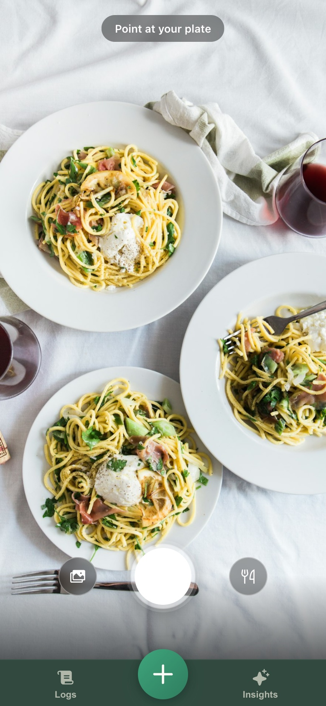
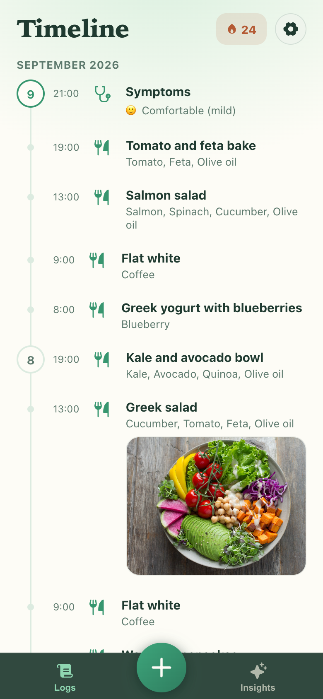
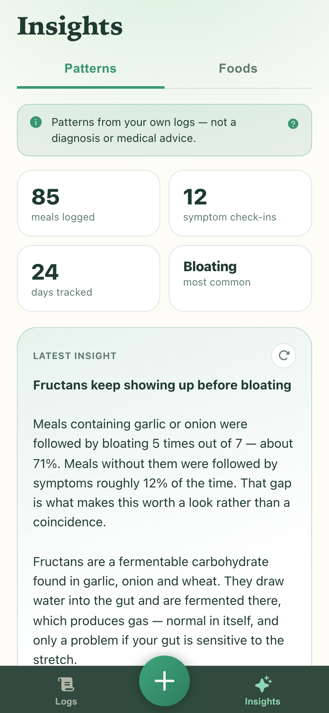
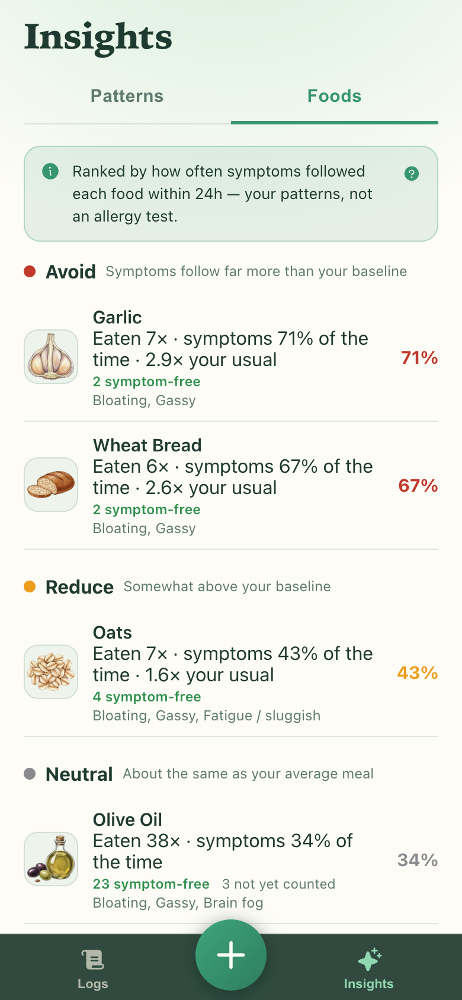

# SnapGut 🍽️

[](https://github.com/nickjessop/snap-gut/actions/workflows/ci.yml)
[](LICENSE)

A self-hosted food and symptom diary that runs on hardware you control. Snap a meal, log how
your gut feels, and see which foods track with your symptoms. The default configuration sends
no diary data off that hardware.

The default configuration uses a local AI model server for meal recognition, stores everything
in a single SQLite file, and needs no cloud account, no API key, and no payment processor.

| | | | |
| :---: | :---: | :---: | :---: |
|  |  |  |  |
| Snap the meal | Log how you feel | Read the patterns | See which foods track |

<sub>Sample data, and the `mock` AI provider — see [docs/screenshots/README.md](docs/screenshots/README.md).</sub>

## Quickstart

1. **Clone the repo**

   ```bash
   git clone https://github.com/nickjessop/snap-gut.git
   cd snap-gut
   ```

2. **Copy the example configuration**

   ```bash
   cp .env.example .env
   ```

   Edit `.env` and set two values, both of which the server refuses to start without:

   - `AUTH_PASSWORD` — at least 12 characters. Required because Docker Compose binds
     `0.0.0.0` inside the container, which counts as an exposed bind. See
     [Security](#security) before you put this anywhere but loopback.
   - `AI_MODEL` — the model tag your AI provider serves, e.g. `llama3.2-vision` for Ollama.
     Required for every provider except `mock`; there is no usable default.

   Just trying it out with no model server? Set `AI_PROVIDER=mock` instead and leave `AI_MODEL`
   empty — `mock` returns synthetic responses and is the one provider that needs no model.

3. **Optionally fetch the food illustration pack** (~70 MB, 3,036 WebP files)

   ```bash
   node scripts/fetch-food-pack.mjs
   ```

   The script verifies the archive's SHA-256 before extracting and leaves the directory
   untouched if it does not match. Skip it and foods render a generated letter avatar instead;
   nothing else changes. While this repository is private the release asset is not anonymously
   downloadable, so use `gh release download food-pack-v1 --pattern 'food-pack-v1.tar.gz'` and
   untar it into `./food-pack` for now. See [docs/food-pack.md](docs/food-pack.md) for the
   provenance and licensing of the images.

4. **Start the service**

   ```bash
   docker compose up
   ```

5. **Open the app**

   Navigate to [http://localhost:8080](http://localhost:8080) in your browser.

## Prerequisites

| Requirement | Notes |
| --- | --- |
| **Node.js 24+** | Required for local development; the app uses the built-in `node:sqlite`. The container image pins Node 24. |
| **Docker** (with Compose) | The supported container runtime and deployment method. |
| **~70 MB free disk** | Only if you download the food illustration pack. |

## Security

This is a personal health diary. Read this before exposing it to anything.

- **The server binds `127.0.0.1` by default and terminates no TLS of its own.** It speaks plain
  HTTP and expects something in front of it if it is reachable from elsewhere.
- **`AUTH_PASSWORD` must be at least 12 characters.** When the bind host is exposed — any
  non-loopback address, which includes the `BIND_HOST=0.0.0.0` that Docker Compose sets inside
  the container — and no valid password is configured, **the server refuses to start**. On a
  loopback bind it starts, but sign-in is rejected until a valid password is set.
- **Put TLS in front of it before exposing it.** A tunnel or a reverse proxy with a real
  certificate, not a plain port forward. The Compose file publishes to `127.0.0.1` for this
  reason.

[SECURITY.md](SECURITY.md) has the fuller self-hosting security notes and the vulnerability
reporting process.

## What the build serves

The build produces static marketing pages alongside the app, and the origin server serves them
at `/`, `/privacy` and `/terms`. So the homepage of your instance is a product landing page,
not the diary. The app itself lives at [`/login`](http://localhost:8080/login) and the routes
under `/app`.

Those pages are plain HTML in [`marketing/`](marketing) — replace or delete them if you would
rather your instance served something else at `/`.

## Reaching the app from your phone (tunnel)

Live camera capture, installation as a PWA, and offline caching each require a **secure
context** (HTTPS). If you access SnapGut over plain HTTP on a local network address, the app
falls back to the platform file picker for photos — this is expected behaviour, not a bug.

To restore live camera capture from a phone, expose SnapGut through an HTTPS tunnel. The
project does not bundle or manage a tunnel; you bring your own.

### Example: Tailscale Funnel

1. Install [Tailscale](https://tailscale.com/download) on the machine running SnapGut.

2. Enable HTTPS certificates:

   ```bash
   tailscale cert
   ```

3. Expose the port with Funnel:

   ```bash
   tailscale funnel 8080
   ```

4. Open the Funnel URL (e.g. `https://your-machine.tailnet-name.ts.net`) on your phone.

   Live camera capture, PWA installation, and offline caching are now available.

Any tunnel that terminates TLS and forwards to `localhost:8080` works the same way — for
example, [cloudflared](https://developers.cloudflare.com/cloudflare-one/connections/connect-networks/)
or an nginx reverse proxy with a Let's Encrypt certificate.

## AI providers

SnapGut uses AI for meal recognition (identifying foods from a photo) and generating dietary
insights. Configure which provider to use with the `AI_PROVIDER` setting in `.env`. Whichever
provider you choose, meal recognition needs a **vision-capable model**.

| `AI_PROVIDER` | What it talks to | Default `AI_BASE_URL` | API key | Data leaves host |
| --- | --- | --- | --- | --- |
| `ollama` (default) | A local [Ollama](https://ollama.com) server | `http://127.0.0.1:11434` | No | No |
| `openai` | OpenAI | `https://api.openai.com` | Yes | Yes |
| `litellm` | A [LiteLLM](https://github.com/BerriAI/litellm) proxy | `http://127.0.0.1:4000` | Optional | Depends on what LiteLLM routes to |
| `openai-compatible` | Any OpenAI-compatible server | none — must be set | Optional | Depends on the server |
| `anthropic` | Anthropic (Claude) | `https://api.anthropic.com` | Yes | Yes |
| `gemini` | Google Gemini | `https://generativelanguage.googleapis.com` | Yes | Yes |
| `mock` | Nothing — synthetic responses, no network call | — | No | No |

`ollama` is what you get when `AI_PROVIDER` is unset. Install a multimodal model (e.g.
`ollama pull llama3.2-vision`), set `AI_MODEL` to that tag, and point `AI_BASE_URL` at the server.
Inside Docker, use `http://host.docker.internal:11434` to reach Ollama running on the host. If no
model server is running at `AI_BASE_URL`, recognition and insight routes return an error but every
other route works normally.

`AI_MODEL` has no default and the server will not boot without it for any provider except `mock` —
an empty model is rejected by every model server, so it fails at boot with a named error rather
than at the first photo with a `503`.

`mock` is the way to run the app with no model server at all — synthetic responses, no network
call. Useful for evaluating SnapGut or developing against it.

### Anything OpenAI-compatible

`openai-compatible` speaks the OpenAI chat-completions API against any server that exposes
`/v1/chat/completions`. That covers local runtimes — vLLM, LM Studio, llama.cpp's server,
text-generation-webui — and hosted gateways: OpenRouter, Groq, Together, Fireworks, DeepSeek,
Mistral.

`AI_BASE_URL` may be given with or without a trailing `/v1`; both work, because the URL is
normalised before the path is appended.

### Two escape hatches

| Setting | Values | What it is for |
| --- | --- | --- |
| `AI_JSON_MODE` | `auto` (default), `json_object`, `off` | Set it to `off` when a gateway-proxied model rejects the `response_format` field, which some do. The prompt asks for JSON regardless and the server defends the parse either way. |
| `AI_EXTRA_HEADERS` | A JSON object of header name to string value | Extra request headers — LiteLLM virtual keys, OpenRouter's attribution headers. |

Full detail for every AI setting is in [docs/configuration.md](docs/configuration.md) and
[docs/ai-providers.md](docs/ai-providers.md).

## Backup and restore

All diary data lives in a single SQLite file. The default path is `/data/snapgut.db` inside the
container, and Compose mounts `./data` on the host at `/data` — so on the host the file is
`./data/snapgut.db`.

### Backup with the server stopped

The server **must be stopped** for this procedure.

1. Stop the container:

   ```bash
   docker compose down
   ```

2. Copy the database file:

   ```bash
   cp ./data/snapgut.db ./data/snapgut.db.backup
   ```

### Backup with the server running

The server **does not need to be stopped** for this procedure; SQLite's `.backup` command takes
a consistent copy of a live database.

1. Run the backup against the running container:

   ```bash
   docker compose exec snapgut node -e "
     const { DatabaseSync } = require('node:sqlite');
     const db = new DatabaseSync('/data/snapgut.db');
     db.exec(\".backup '/data/snapgut.db.backup'\");
     db.close();
   "
   ```

### Restore

The server **must be stopped** before you replace the file.

1. Stop the container:

   ```bash
   docker compose down
   ```

2. Replace the database file with your backup:

   ```bash
   cp ./data/snapgut.db.backup ./data/snapgut.db
   ```

3. Start the container:

   ```bash
   docker compose up
   ```

[docs/datastore.md](docs/datastore.md) covers the schema and what is safe to copy while the
server is live.

## Upgrade

1. **Back up the database** (see above) — schema changes apply automatically on boot, so keep
   a copy in case you need to roll back.

2. Pull the latest code:

   ```bash
   git pull
   ```

3. Rebuild and restart:

   ```bash
   docker compose up --build
   ```

Schema migrations run automatically when the server starts. No manual migration step is
required.

## Troubleshooting

### Model server unreachable

**Symptom:** Recognition or insight requests return an error mentioning the AI provider.

**Fix:** Verify `AI_BASE_URL` is set and the model server is running. Inside Docker, use
`http://host.docker.internal:11434` instead of `http://127.0.0.1:11434` — the container
cannot reach `localhost` on the host without this mapping.

### Port already in use

**Symptom:** The container fails to start with "address already in use" on port 8080.

**Fix:** Either stop the process occupying the port, or change the `PORT` variable in `.env`
and update the `ports` mapping in `docker-compose.yml` to match.

### Data directory not writable

**Symptom:** The server exits immediately with an error naming the `/data` path.

**Fix:** Ensure the `./data` directory on the host exists and is owned by **UID 10001**, the
`snapgut` user inside the container:

```bash
mkdir -p ./data
sudo chown -R 10001:10001 ./data
```

The UID and GID are pinned to 10001 in the `Dockerfile` so this number stays correct across base
image updates. `chmod 755 ./data` is enough only when the directory is already owned by a matching
UID; if the server still cannot write after that, ownership is the problem, not the mode. More in
[docs/operations.md](docs/operations.md).

### Camera unavailable over HTTP

**Symptom:** The camera button shows a file picker instead of a live viewfinder.

**Fix:** Browsers restrict camera access to secure contexts (HTTPS or `localhost`). If you are
accessing SnapGut from another device over HTTP, set up a tunnel (see the tunnel section
above). The file-picker fallback is the expected behaviour on plain HTTP and is not a fault.

## Configuration

All settings are documented in [`.env.example`](.env.example). Key settings:

| Setting | Default | Purpose |
| --- | --- | --- |
| `PORT` | `8080` | Port the server listens on |
| `BIND_HOST` | `127.0.0.1` | Address the server binds; non-loopback requires `AUTH_PASSWORD` |
| `AUTH_PASSWORD` | _(empty)_ | Password for signing in; minimum 12 characters |
| `AI_PROVIDER` | `ollama` | ollama, openai, openai-compatible, litellm, anthropic, gemini, mock |
| `AI_BASE_URL` | per provider | Model server URL |
| `AI_MODEL` | _(none)_ | Model identifier; required for every provider except `mock` |
| `DATA_DIR` | `/data` | Where the database and session secret are stored |
| `FOOD_PACK_DIR` | `./food-pack` | Directory for food illustrations |

See [docs/configuration.md](docs/configuration.md) for the full reference.

## Development

Node 24+ and npm. No model server or API key is needed — `AI_PROVIDER=mock` returns synthetic
responses.

```bash
npm install
cp .env.example .env          # then set AI_PROVIDER=mock
npm run dev                   # Vite dev server and the API together
```

`AI_PROVIDER=mock` is the whole change needed: it is the one provider that needs no `AI_MODEL`, so
nothing else in the copied file blocks boot.

Other commands:

```bash
npm test                      # vitest suite
npm run typecheck             # tsc --noEmit
npm run build                 # production bundle plus the marketing pages
```

To run the API on its own with the env file loaded:

```bash
node --env-file=.env server/main.js
```

### Project layout

| Path | Contents |
| --- | --- |
| `server/` | Hono API and boot — `server/main.js` is the sole entry point |
| `server/ai/` | Provider adapters |
| `server/sqlite/` | The datastore |
| `src/` | React PWA and the test suite |
| `shared/` | Route table shared by client and server |
| `vite/` | Build plugins |
| `marketing/` | Static marketing pages |
| `brand/` | Brand assets |
| `docs/` | Documentation |


[CONTRIBUTING.md](CONTRIBUTING.md) covers conventions, the test philosophy, and how changes are
reviewed.

## Documentation

| Document | Covers |
| --- | --- |
| [docs/README.md](docs/README.md) | Documentation index |
| [docs/configuration.md](docs/configuration.md) | Every setting, its default, and its failure mode |
| [docs/ai-providers.md](docs/ai-providers.md) | Provider adapters in detail |
| [docs/deployment.md](docs/deployment.md) | Deploying and exposing an instance |
| [docs/operations.md](docs/operations.md) | Running an instance day to day |
| [docs/architecture.md](docs/architecture.md) | How the pieces fit together |
| [docs/datastore.md](docs/datastore.md) | SQLite schema and backup detail |
| [docs/cloud-sync.md](docs/cloud-sync.md) | The sync protocol |
| [docs/food-pack.md](docs/food-pack.md) | The optional illustration pack: fetching it, provenance, licensing |

## Contributing and community

| Document | Covers |
| --- | --- |
| [CONTRIBUTING.md](CONTRIBUTING.md) | Development setup, conventions, and how to send a change |
| [CODE_OF_CONDUCT.md](CODE_OF_CONDUCT.md) | Expected behaviour and how to report a problem |
| [SECURITY.md](SECURITY.md) | Reporting a vulnerability and self-hosting security notes |
| [CHANGELOG.md](CHANGELOG.md) | What changed in each release |

## Medical disclaimer

SnapGut is a **food diary**, not a medical device. Its meal recognition and dietary insight
outputs are generated by a language model and do not constitute medical advice, diagnosis, or
treatment recommendations. Always consult a qualified health professional before making
changes to your diet or treatment plan.

## License

SnapGut is licensed under **AGPL-3.0-or-later**. In practice that means modifications you
distribute — or offer to others over a network — must be made available under the same terms.

See [LICENSE](LICENSE) for the full text.

The food illustration pack is **MIT-licensed** — deliberately more permissive than the code,
and carried as a `LICENSE` file inside the archive itself. It is not part of this repository;
it is distributed separately as a release artifact. See
[docs/food-pack.md](docs/food-pack.md).
